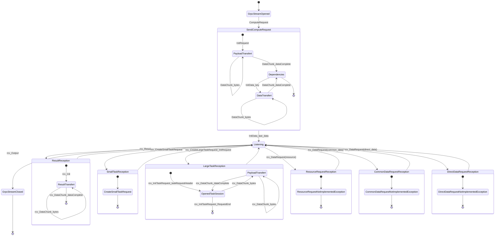

# Polling Agent

## Client

```mermaid
stateDiagram-v2
    [*] --> GrpcStreamOpened
    GrpcStreamOpened --> SendComputeRequest:ComputeRequest
    state SendComputeRequest {
        SCR_PayloadTransfert : PayloadTransfert
        SCR_Dependencies : Dependencies
        SCR_DataTransfert : DataTransfert
        
        [*] --> SCR_PayloadTransfert:InitRequest
        SCR_PayloadTransfert --> SCR_PayloadTransfert:DataChunk_bytes
        SCR_PayloadTransfert --> SCR_Dependencies:DataChunk_dataComplete
        SCR_Dependencies --> SCR_DataTransfert : InitData_key
        SCR_DataTransfert --> SCR_DataTransfert:DataChunk_bytes
        SCR_DataTransfert --> SCR_Dependencies : DataChunk_dataComplete
        SCR_Dependencies --> [*]
    }
    SendComputeRequest --> Listening:InitData_last_data

    Listening --> GrpcStreamClosed:rcv_Output
    Listening --> ResultReception:rcv_Result
    Listening --> SmallTaskReception:rcv_CreateSmallTaskRequest
    Listening --> LargeTaskReception:rcv_CreateLargeTaskRequest_InitRequest
    Listening --> ResourceRequestReception:rcv_DataRequest(resource)
    Listening --> CommonDataRequestReception:rcv_DataRequest(common_data)
    Listening --> DirectDataRequestReception:rcv_DataRequest(direct_data)
        
    state ResultReception {
        [*] --> ResultTransfert:rcv_Init
        ResultTransfert --> ResultTransfert:rcv_DataChunk_bytes
        ResultTransfert -->[*] : rcv_DataChunk_dataComplete
    }
    ResultReception-->Listening
    
    
    state SmallTaskReception {
        [*] --> CreateSmallTaskRequest
        CreateSmallTaskRequest --> [*]
    }
    SmallTaskReception --> Listening
    
    state LargeTaskReception {
        LT_PayloadTransfert : PayloadTransfert
    
        [*] --> OpenedTaskSession:rcv_InitTaskRequest_taskRequestHeader
        OpenedTaskSession --> [*]:rcv_InitTaskRequest_RequestEnd
        OpenedTaskSession --> LT_PayloadTransfert:rcv_DataChunk_bytes
        LT_PayloadTransfert --> LT_PayloadTransfert:rcv_DataChunk_bytes
        LT_PayloadTransfert --> OpenedTaskSession:rcv_DataChunk_dataComplete       
    }
    LargeTaskReception --> Listening
    
    state ResourceRequestReception {
        [*] --> ResourceRequestNotImplementedException
        ResourceRequestNotImplementedException --> [*]
    }
    ResourceRequestReception --> Listening
    
    state CommonDataRequestReception {
        [*] --> CommonDataRequestNotImplementedException
        CommonDataRequestNotImplementedException --> [*]
    }
    CommonDataRequestReception --> Listening
    
    state DirectDataRequestReception {
        [*] --> DirectDataRequestNotImplementedException
        DirectDataRequestNotImplementedException --> [*]
    }
    DirectDataRequestReception --> Listening

    GrpcStreamClosed --> [*]
```
