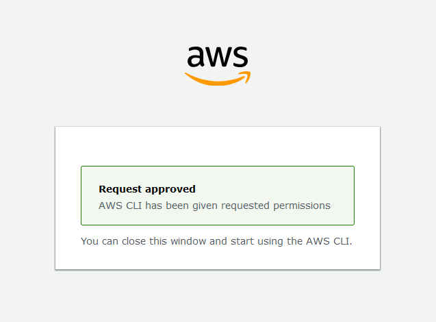

# AWS Setup 🚀

This guide will help you install and configure the AWS CLI on your system and set up your AWS environment for use.

## 1. Installation & Configuration 

Follow the official AWS CLI install guide [here](https://docs.aws.amazon.com/cli/latest/userguide/getting-started-install.html).

For Linux-based systems, you can use the following commands:

```bash
curl "https://awscli.amazonaws.com/aws-cli-exe-linux-x86_64.zip" -o "awscliv2.zip"
unzip awscliv2.zip
sudo ./aws/install
```

Ensure the AWS CLI is installed correctly by checking its version:
```bash
aws --version
```

## 2. Configure AWS CLI

Once installed, you need to configure the AWS CLI with your credentials:

```bash
aws configure
```

During configuration:
- Enter your **Access Key ID** and **Secret Access Key** (provided by AWS).
- Choose a default region, e.g., *eu-west-3* (optional but recommended).
- Specify the default output format (e.g., *json*, *table*, or *text*).

To use AWS environnement, you can use the following:

```bash
aws sso login
```

You should see output similar to this:

```bash
❯ aws sso login
Attempting to automatically open the SSO authorization page in your default browser.
If the browser does not open or you wish to use a different device to authorize this request, open the following URL:

https://oidc.us-east-1.amazonaws.com/authorize?response_type=code&client_id=0uoUxJybzUUq_mYjylZIi3VzLWVhc3QtMQ&redirect_uri=http%3A%2F%2F127.0.0.1%3A38685%2Foauth%2Fcallback&state=e640ba3b-87db-4159-853a-b16e17b33a35&code_challenge_method=S256&scopes=sso%3Aaccount%3Aaccess&code_challenge=lDqNKJA0DtmC_nnm14B52EQNry2pJPINa724m86vqeY
gio: https://oidc.us-east-1.amazonaws.com/authorize?response_type=code&client_id=0uoUxJybzUUq_mYjylZIi3VzLWVhc3QtMQ&redirect_uri=http%3A%2F%2F127.0.0.1%3A38685%2Foauth%2Fcallback&state=e640ba3b-87db-4159-853a-b16e17b33a35&code_challenge_method=S256&scopes=sso%3Aaccount%3Aaccess&code_challenge=lDqNKJA0DtmC_nnm14B52EQNry2pJPINa724m86vqeY: Operation not supported
```

## Step 1: Authorize in the Browser

- Click on the first URL provided in the output.
- This will open the SSO authorization page in your default browser.
- After logging in, you’ll be prompted to grant permissions.

## Step 2: Verify Login

- Once authorized, the CLI will confirm successful login.
- Your authorization page should look similar to this:

