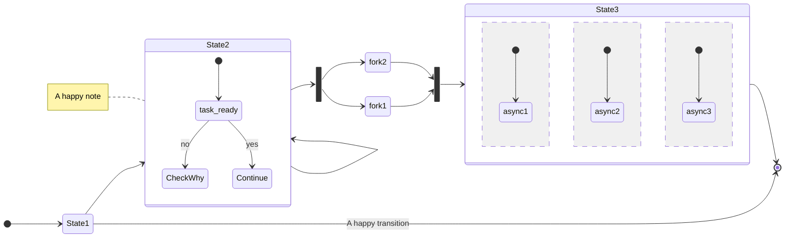

<!-- TODO: move to the documentation of documentation -->

[Mermaid](https://mermaid-js.github.io/mermaid/#/) is a JavaScript based diagramming and charting tool. Recently,
github added support to render mermaid code directly into the web browser. For example the code

~~~text

~~~

will be rendered as

<Mermaid>
stateDiagram 
    direction LR
    [*] --> State1
    State1 --> [*]: A happy transition
    State1 --> State2
    %% This is how you declare composite states
    state State2 {
        [*] --> task_ready
        task_ready --> CheckWhy: no
        task_ready --> Continue: yes
    }
    State2 --> State2
    note left of State2 : A happy note
    %% This is how you make forks
    state fork_state <<fork>>
    State2 --> fork_state
    fork_state --> fork1
    fork_state --> fork2
    %% and how to merge them
    state join_state <<join>>
    fork1 --> join_state
    fork2 --> join_state
    %% And this how specify concurrency
    state State3 {
        [*]-->async1
        --
        [*]-->async2
        --
        [*]-->async3
    }
    join_state --> State3
    State3 --> [*]
</Mermaid>

You can use [this live editor](https://mermaid.live)
to produce your charts and then just put them into a markdown file in your repository. Have fun :)
