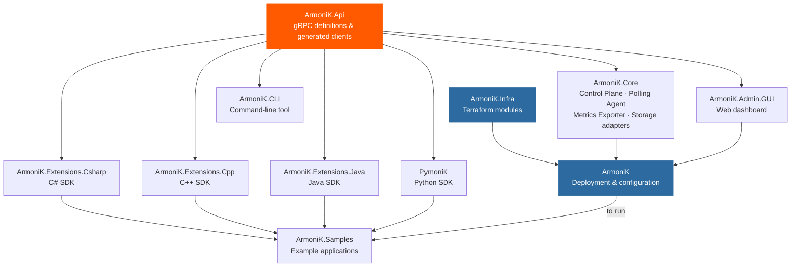

# Local Development Setup

This guide covers setting up a local ArmoniK deployment for development: installing prerequisites, deploying the stack, iterating on components, and tearing down cleanly.

For a production-grade or cloud deployment, see [Detailed Installation](../installation/0.prerequisites.md).

---

## Repository structure

ArmoniK is spread across multiple repositories. For local development you will typically work in one or two of them depending on what you are changing:

| Repository | What lives there |
|---|---|
| [ArmoniK](https://github.com/aneoconsulting/ArmoniK) | Infrastructure deployment (this repo) — Terraform modules, deployment scripts, `parameters.tfvars` |
| [ArmoniK.Core](https://github.com/aneoconsulting/ArmoniK.Core) | Control Plane, Polling Agent, Metrics Exporter, and storage adapters |
| [ArmoniK.Api](https://github.com/aneoconsulting/ArmoniK.Api) | gRPC API definitions and generated clients (C#, C++, Python, Rust, Java, JS) |
| [ArmoniK.Infra](https://github.com/aneoconsulting/ArmoniK.Infra) | Reusable Terraform modules for all supported backends and cloud providers |
| [ArmoniK.Extensions.Csharp](https://github.com/aneoconsulting/ArmoniK.Extensions.Csharp.New) | High-level C# SDK |
| [ArmoniK.Extensions.Cpp](https://github.com/aneoconsulting/ArmoniK.Extensions.Cpp) | C++ SDK |
| [ArmoniK.Extensions.Java](https://github.com/aneoconsulting/ArmoniK.Extensions.Java) | Java SDK |
| [PymoniK](https://github.com/aneoconsulting/PymoniK) | Python client library |
| [ArmoniK.Samples](https://github.com/aneoconsulting/ArmoniK.Samples) | Example applications in all supported languages |
| [ArmoniK.Admin.GUI](https://github.com/aneoconsulting/ArmoniK.Admin.GUI) | Web admin dashboard |
| [ArmoniK.CLI](https://github.com/aneoconsulting/ArmoniK.CLI) | Command-line tool for managing a deployment |

## Dependencies between repositories



```{note}
ArmoniK.Samples can be built using only the SDK repositories. A running ArmoniK deployment is only required to **execute** the samples, not to compile or package them.
```

For most development work you need at minimum the main **ArmoniK** repo (for deploying the stack) and the repo containing the component you are working on.

---

## Prerequisites

### Automated install (recommended)

The prerequisites installer handles everything in one shot:

```bash
git clone https://github.com/aneoconsulting/ArmoniK.git
cd ArmoniK
chmod +x ./tools/installation/prerequisites-installer.sh
./tools/installation/prerequisites-installer.sh
```

This installs: `git`, `jq`, `make`, `python3`, `pip3`, `helm`, `docker`, `kubectl`, `terraform`, and `k3s`.

### Windows

ArmoniK requires Linux. On Windows, use [WSL2](https://learn.microsoft.com/en-us/windows/wsl/install) with systemd enabled, then run the installer above inside the WSL2 shell. Disable Docker Desktop before running the installer — it conflicts with the Docker installation inside WSL2.

### Manual install

If you prefer to install tools individually, see the [detailed prerequisites page](../installation/0.prerequisites.md). Follow the versions pinned in [`versions.tfvars.json`](https://github.com/aneoconsulting/ArmoniK/blob/main/versions.tfvars.json) to avoid compatibility issues.

---

## Deploying the local stack

The local deployment lives in `infrastructure/quick-deploy/localhost/`. All commands are run from that directory.

```bash
cd infrastructure/quick-deploy/localhost
```

### First deployment

```bash
make deploy
```

This runs, in order: `get-modules` → `init` → `apply` → `output` → `cliconfig`.

- **`get-modules`** — clones or updates [ArmoniK.Infra](https://github.com/aneoconsulting/ArmoniK.Infra) at the version pinned in `versions.tfvars.json` into `generated/infra-modules/`
- **`init`** — initialises Terraform and downloads providers
- **`apply`** — deploys all components to the local K3s cluster
- **`output`** — writes service URLs and config to `generated/armonik-output.json`
- **`cliconfig`** — prints the `export AKCONFIG=...` command to point the ArmoniK CLI at this deployment

After a successful deploy, copy the `export AKCONFIG=...` line from the terminal output and run it in your shell to configure the CLI.

### Checking the deployment

```bash
# Service URLs and endpoints
cat generated/armonik-output.json | jq .

# Pod status
kubectl get pods -n armonik
```

---

## Day-to-day Makefile targets

| Target | What it does |
|---|---|
| `make deploy` | Full deploy: modules + init + apply + output + cliconfig |
| `make apply` | Apply Terraform changes only (skips module fetch and init — faster for iterating) |
| `make plan` | Show what Terraform would change without applying |
| `make output` | Re-write `generated/armonik-output.json` from current Terraform state |
| `make destroy` | Tear down the entire deployment |
| `make clean` | Remove generated Terraform state and plugin cache (use before a fresh `make deploy`) |
| `make import-error` | Recover from a corrupted Terraform state after an interrupted apply |

### Using a different parameters file

```bash
make deploy PARAMETERS_FILE=my-custom.tfvars
```

`PARAMETERS_FILE` defaults to `parameters.tfvars`. Useful for keeping multiple named configurations side by side.

---

## Iterating on a component

### How component versions are controlled

`versions.tfvars.json` at the root of the repo pins the Docker image tag for every ArmoniK component. To use a locally built image instead, override the relevant tag.

For example, to test a local build of ArmoniK.Core:

**1. Build and push your image to a local registry** (or use `docker load`):

```bash
# From the ArmoniK.Core repo
docker build -t localhost:5000/armonik_control:dev -f Control/src/Dockerfile .
docker push localhost:5000/armonik_control:dev
```

**2. Override the image in `parameters.tfvars`** using the `configurations` or the partition's `worker.image` / `worker.tag` fields. For Core components, edit the relevant section in `parameters.tfvars` to:

- Point control-plane to your local image
- Add to your parameters.tfvars or a custom .tfvars file
- Or, pass it directly as a Terraform variable override. See [`parameters.tfvars`](../user-guide/6.deployment-configuration.md) for the full field reference.

**3. Re-apply**:

```bash
make apply
```

Terraform will detect the changed image reference and perform a rolling update of the affected pods.

### Recovering from a corrupted Terraform state

If `terraform apply` was interrupted (power loss, Ctrl+C twice), an `errored.tfstate` file is left behind. Recover with:

```bash
make import-error
```

This pushes the errored state back into the backend and unlocks any stale locks automatically.

---

## Useful development configurations

### Enabling verbose logging

In `parameters.tfvars`:

```hcl
logging_level = "Debug"  # or "Verbose" for maximum detail
```

Then `make apply`.

### Keeping task records for longer

By default, completed task records are retained for 1 day. During development it is useful to extend this:

```hcl
configurations = {
  core = {
    env = {
      MongoDB__DataRetention = "7.00:00:00"  # 7 days
      Redis__TtlTimeSpan     = "7.00:00:00"
    }
  }
}
```

### Keeping payloads for inspection

`Submitter__DeletePayload = false` is the default, so task input payloads are kept in object storage after completion for inspection. If you have set it to `true` (e.g. to free up storage), revert it during development:

```hcl
configurations = {
  core = {
    env = {
      Submitter__DeletePayload = false
    }
  }
}
```

---

## Working with the ArmoniK CLI

### Installation

The recommended way to install the CLI is via [pipx](https://pypa.github.io/pipx/), which keeps it isolated from your system Python:

```bash
pipx install armonik-cli
```

Alternatively, install with pip:

```bash
pip install armonik-cli
```

Verify the installation:

```bash
armonik --version
```

### Connecting to a deployment

After deployment, point the CLI at the generated config file:

```bash
export AKCONFIG=$(pwd)/generated/armonik-cli.yaml
```

This file is written by `make output`. The CLI can then be used to list sessions, inspect tasks, and cancel work:

```bash
armonik session list
armonik task list --session <session-id>
```

See the [ArmoniK.CLI documentation](https://armonikadmincli.readthedocs.io/en/latest/) for the full command reference.

---

## Tearing down

```bash
make destroy
```

This removes all Kubernetes resources and Terraform state. Run `make clean` afterwards to remove the local Terraform cache if you want a fully clean slate for the next deployment.
