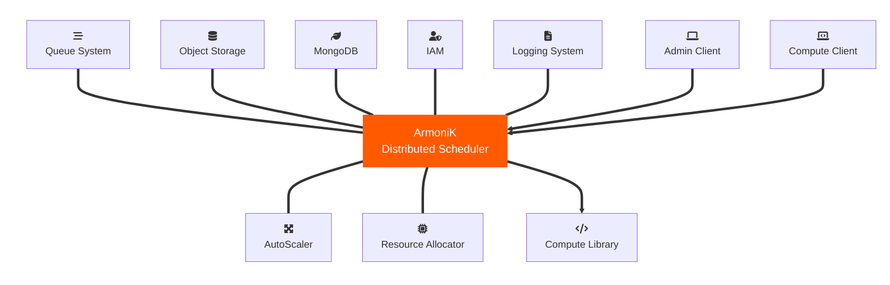

# Architecture overview

Here is an overview of how Armonik works:

## Mermaid test

```mermaid

flowchart TB
    subgraph TOP[" "]
        direction LR
        Queue["fa:fa-stream<br/>Queue System"]
        ObjectStorage["fa:fa-database<br/>Object Storage"]
        Mongo["fa:fa-leaf<br/>MongoDB"]
        IAM["fa:fa-user-shield<br/>IAM"]
        Logging["fa:fa-file-alt<br/>Logging System"]
    end

    ADS["ArmoniK<br/>Distributed Scheduler"]

    subgraph BOTTOM[" "]
        direction LR
        AutoScaler["fa:fa-expand-arrows-alt<br/>AutoScaler"]
        ResourceAllocator["fa:fa-microchip<br/>Resource Allocator"]
    end

    Admin["fa:fa-laptop<br/>Admin Client"]
    ComputeClient["fa:fa-laptop-code<br/>Compute Client"]
    ComputeLib["fa:fa-code<br/>Compute Library"]

    Queue === ADS
    ObjectStorage === ADS
    Mongo === ADS
    IAM === ADS
    Logging === ADS

    ADS === AutoScaler
    ADS === ResourceAllocator

    Admin ==> ADS
    ComputeClient ==> ADS
    ADS ==> ComputeLib

    style ADS fill:#ff5a00,color:#ffffff,stroke:#ff5a00,font-size:18px
    style TOP fill:transparent,stroke:transparent
    style BOTTOM fill:transparent,stroke:transparent

    linkStyle default stroke-width:4px
```
