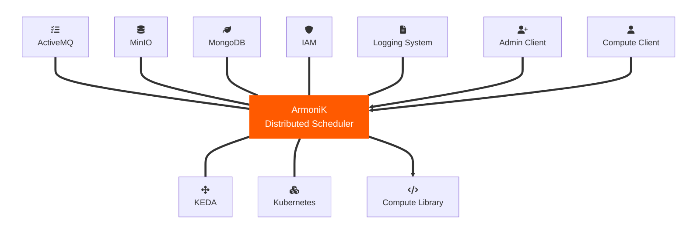
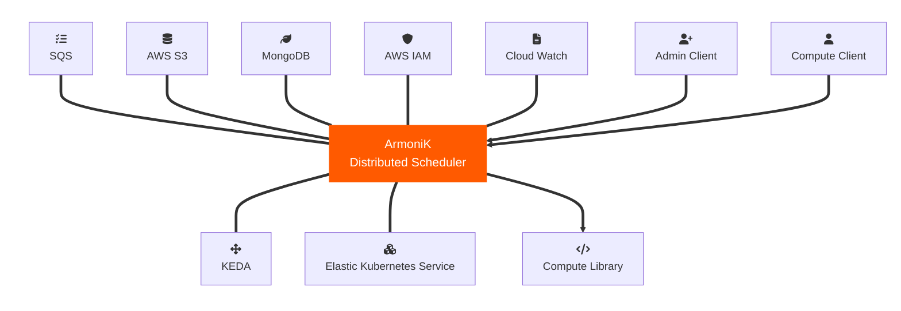

# Architecture overview

## Composable framework

|Deployment type| Queue system | Object Storage | IAM | Logging System | Autoscaler | Resource Allocator |
|---|---|---|---|---|---|---|
Vanilla Kubernetes | ActiveMQ | MinIO | IAM | Logging System | KEDA | Kubernetes
Amazon Web Services | SQS | S3 | AWS IAM | Cloud Watch | KEDA | EKS
Google Cloud Platform | PubSub | GCS | GCP IAM | Cloud Monitoring | KEDA | GKS

<!--

## Vanilla Kubernetes deployment

## Designed for cloud integration: AWS deployment example

-->

## High level architecture

### 1. Compute Plane
- **Purpose:** The Compute Plane is responsible for executing the main computational workloads.
- **Instances:** 
  - **Agent:** Manages and orchestrates tasks within the Compute Plane.
  - **Worker:** Executes the actual workloads or tasks assigned by the Agent.

#### **Partitions**
- The Compute Plane may consist of multiple partitions, for a detailed discussion see the [partitioning guide](./2.how-to-configure-partitions.md/#what-partitioning-means-in-armonik). 

### 2. Control Plane
- **Purpose:** The Control Plane oversees the entire system, managing workload submission, logging, and performance metrics.
  
#### **Key Components:**
- **Submitter:** Responsible for submitting workloads to the Compute Plane.
- **Logs:** Captures event logs for monitoring and debugging.
- **Metrics:** Collects performance metrics to analyze system efficiency and resource usage.

### 3. Storage (Data Plane)
- **Purpose:** Storage handles data management, ensuring that workloads have access to necessary data.

#### **Storage Types:**
- **Queue:** Used for managing task submissions and ensuring tasks are executed in a controlled manner.
- **Object Storage:** Manages files and objects that may be needed during computation (Inputs/Outputs).
- **Database:** Stores task's  meta data, potentially for persistent storage of results or job state.

## Architecture internals

