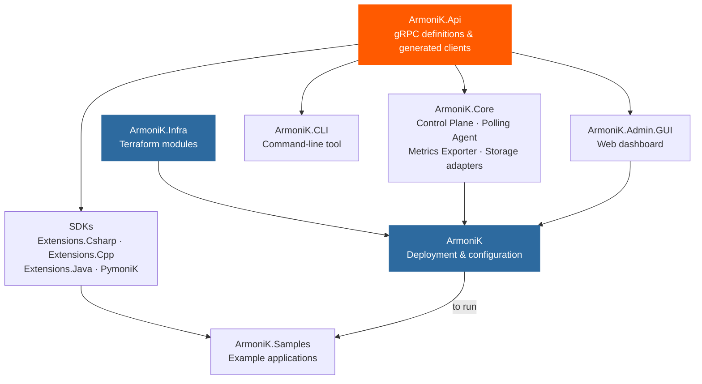

# Repositories

ArmoniK is spread across multiple repositories:

| Repository | What lives there |
|---|---|
| [ArmoniK](https://github.com/aneoconsulting/ArmoniK) | Deployment configuration (this repo) — top-level Terraform configurations that wire together modules from ArmoniK.Infra |
| [ArmoniK.Core](https://github.com/aneoconsulting/ArmoniK.Core) | Control Plane, Polling Agent, Metrics Exporter, and storage adapters |
| [ArmoniK.Api](https://github.com/aneoconsulting/ArmoniK.Api) | gRPC API definitions and generated clients (C#, C++, Python, Rust, Java, JS) |
| [ArmoniK.Infra](https://github.com/aneoconsulting/ArmoniK.Infra) | Reusable Terraform modules for all supported backends and cloud providers |
| [ArmoniK.Extensions.Csharp](https://github.com/aneoconsulting/ArmoniK.Extensions.Csharp.New) | High-level C# SDK |
| [ArmoniK.Extensions.Cpp](https://github.com/aneoconsulting/ArmoniK.Extensions.Cpp) | C++ SDK |
| [ArmoniK.Extensions.Java](https://github.com/aneoconsulting/ArmoniK.Extensions.Java) | Java SDK |
| [PymoniK](https://github.com/aneoconsulting/PymoniK) | Python client library |
| [ArmoniK.Samples](https://github.com/aneoconsulting/ArmoniK.Samples) | Example applications in all supported languages |
| [ArmoniK.Admin.GUI](https://github.com/aneoconsulting/ArmoniK.Admin.GUI) | Web admin dashboard |
| [ArmoniK.CLI](https://github.com/aneoconsulting/ArmoniK.CLI) | Command-line tool for managing a deployment |

## Dependencies between repositories



```{note}
ArmoniK.Samples can be built using only the SDK repositories. A running ArmoniK deployment is only required to **execute** the samples, not to compile or package them.
```

For most development work you need at minimum the main **ArmoniK** repo (for deploying the stack) and the repo containing the component you are working on. See [Local Development Setup](../contrib-and-dev/local-dev-setup.md) for getting started.
