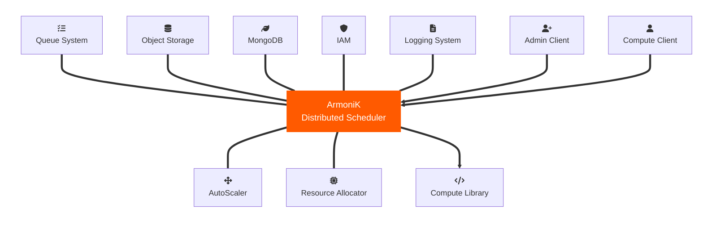
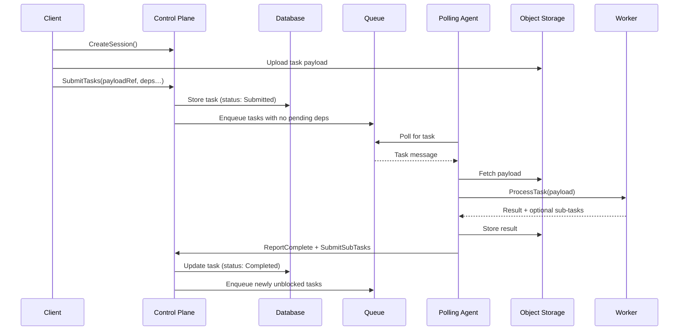

# Architecture Overview

ArmoniK is built as a **composable framework**: its orchestration core plugs into standard infrastructure services (queue, object storage, database) rather than bundling its own. This design lets you swap in cloud-managed services (SQS, S3, Pub/Sub) or self-hosted alternatives (RabbitMQ, MinIO) without changing your application code.

The infrastructure components used vary by deployment target:

| Deployment type | Queue | Object Storage | IAM | Logging | Autoscaler | Resource Allocator |
|---|---|---|---|---|---|---|
| Vanilla Kubernetes | ActiveMQ | MinIO | — | Fluent Bit / Seq | KEDA | Kubernetes |
| Amazon Web Services | SQS | S3 | AWS IAM | CloudWatch | KEDA | EKS |
| Google Cloud Platform | Pub/Sub | GCS | GCP IAM | Cloud Monitoring | KEDA | GKE |

---

## Components

### Control Plane

The Control Plane is the central gRPC service of ArmoniK. It is the single entry point for clients and is responsible for:

- Creating and managing **sessions** (logical groupings of related tasks)
- Accepting **task submissions** and storing task metadata in the database
- Tracking **task dependencies**: a task is only dispatched once all its declared dependencies are complete
- Enqueuing tasks that are ready to execute into the message queue
- Exposing task and session state to clients and to the Admin GUI

### Compute Plane

The Compute Plane is the set of pods that execute your workload. Each replica runs two containers side by side:

- **Polling Agent** — the ArmoniK-provided sidecar that polls the queue for work, fetches task payloads from object storage, drives task execution on the Worker, and reports results back to the Control Plane.
- **Worker** — your application container, which receives tasks from the Polling Agent over a local gRPC connection and returns results.

The Compute Plane is divided into **partitions**: isolated groups of pods with their own queue, worker image, node selector, and scaling configuration. See the [partitioning guide](./3.how-to-configure-partitions.md) for setup details.

### Metrics Exporter

The Metrics Exporter reads task-state counts from the database and exposes them as Prometheus metrics. KEDA reads those metrics to decide how many Worker pods each partition needs. See [scaling & performance](../admin-ops/2.scaling_and_perf.md) for tuning guidance.

### Supporting infrastructure

| Service | Role |
|---|---|
| **Queue** | Carries task dispatch messages from the Control Plane to the Polling Agents |
| **Object Storage** | Stores task payloads (inputs) and results (outputs) |
| **Database (MongoDB)** | Stores task metadata, session state, and result references |
| **KEDA** | Scales Compute Plane pods up and down based on queue depth metrics |
| **IAM** | Authentication and authorization (cloud deployments) |
| **Logging system** | Aggregates logs from all components for debugging and audit |

---

## Task Lifecycle

The sequence below shows how a task travels from submission to completion.

**Dependency resolution** — tasks can declare dependencies on the results of other tasks. The Control Plane tracks these automatically and only enqueues a task once all its dependencies are satisfied. This lets you express DAG-shaped workflows without any polling or sleeping in application code.

**Sub-task submission** — a Worker can submit new tasks during its own execution. This enables recursive and tree-shaped workloads where the full task graph is not known upfront.

**Fault tolerance** — if a Worker pod is lost mid-execution, the Polling Agent's lease on the task expires and the Control Plane re-enqueues it for another pod to pick up, up to the configured `MaxRetries` limit.

---

## Internal Architecture

The diagram below shows the internal wiring of an ArmoniK deployment, including the gRPC interfaces between components.

The key interfaces are:

| Interface | Protocol | Direction |
|---|---|---|
| Client → Control Plane | gRPC (ArmoniK API) | Session and task management |
| Control Plane → Queue | AMQP / SQS / Pub/Sub | Task dispatch |
| Control Plane ↔ Database | MongoDB wire protocol | Task and session state reads/writes |
| Polling Agent → Control Plane | gRPC | Status updates, sub-task submission |
| Polling Agent ↔ Object Storage | S3-compatible API | Payload fetch, result store |
| Polling Agent → Worker | gRPC (local) | `ProcessTask` call |
| Metrics Exporter → Prometheus | HTTP (scrape) | Task-state metrics |
| KEDA → HPA | Kubernetes API | Scale decisions |

---

## Admin GUI

The [Admin GUI](https://github.com/aneoconsulting/ArmoniK.Admin.GUI) is a web application that connects to the Control Plane's gRPC API and lets operators:

- Browse sessions and tasks, filter by status, partition, or time range
- Cancel sessions or individual tasks
- Inspect task inputs, outputs, and error messages
- Monitor partition queue depths and worker counts in real time

See [Personalizing the Admin GUI](./6.configure-gui.md) for configuration options.
