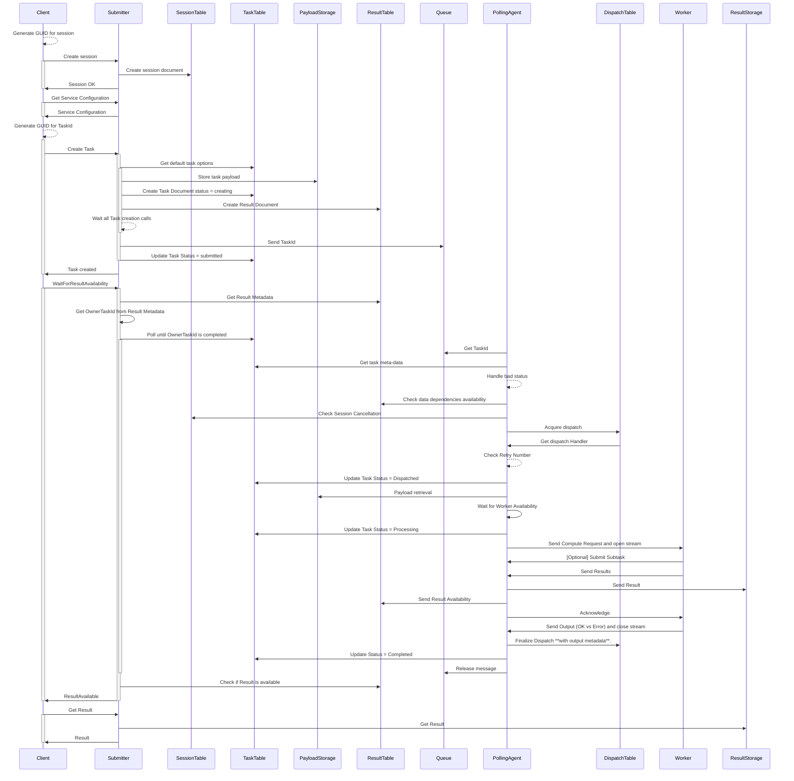

# Happy Flow Diagram Sequence

```mermaid
sequenceDiagram
    #title ArmoniK Happy Flow Sequence
    Client-->>Client:Generate GUID for session
    Client->>Submitter:Create session
    activate Client
    Submitter->>SessionTable:Create session document
    Submitter->>Client:Session OK
    deactivate Client
    Client->>Submitter:Get Service Configuration
    activate Client
    Submitter->>Client:Service Configuration
    deactivate Client
    Client-->>Client:Generate GUID for TaskId
    activate Client
    Client->>Submitter:Create Task
    activate Submitter
    Submitter->>TaskTable:Get default task options
    activate Submitter
    Submitter->>PayloadStorage:Store task payload
    Submitter->>TaskTable:Create Task Document status = creating
    Submitter->>ResultTable:Create Result Document
    Submitter-->>Submitter:Wait all Task creation calls
    deactivate Submitter
    #TODO : check order of next 2 lines
    Submitter->>Queue:Send TaskId
    Submitter->>TaskTable:Update Task Status = submitted
    deactivate Submitter
    Submitter->>Client:Task created
    deactivate Client
    Client->>Submitter:WaitForResultAvailability
    activate Client
    activate Submitter
    Submitter->>ResultTable:Get Result Metadata
    Submitter->>Submitter:Get OwnerTaskId from Result Metadata
    Submitter->>TaskTable:Poll until OwnerTaskId is completed
    activate Submitter
    PollingAgent->>Queue:Get TaskId
    #Check Preconditions
    PollingAgent->>TaskTable:Get task meta-data
    PollingAgent-->>PollingAgent:Handle bad status
    PollingAgent->>ResultTable:Check data dependencies availability
    PollingAgent->>SessionTable:Check Session Cancellation
    PollingAgent->>DispatchTable:Acquire dispatch
    DispatchTable->>PollingAgent:Get dispatch Handler
    PollingAgent-->>PollingAgent:Check Retry Number
    PollingAgent->>TaskTable:Update Task Status = Dispatched
    #Data Prefetch
    PollingAgent->>PayloadStorage:Payload retrieval
    PollingAgent->>PollingAgent:Wait for Worker Availability
    #Process
    PollingAgent->>TaskTable:Update Task Status = Processing
    PollingAgent->>Worker:Send Compute Request and open stream
    Worker->>PollingAgent:[Optional] Submit Subtask
    Worker->>PollingAgent:Send Results
    PollingAgent->>ResultStorage:Send Result
    PollingAgent->>ResultTable:Send Result Availability
    PollingAgent->>Worker: Acknowledge
    Worker->>PollingAgent:Send Output (OK vs Error) and close stream
    PollingAgent->>DispatchTable:Finalize Dispatch **with output metadata**.
    PollingAgent->>TaskTable:Update Status = Completed
    PollingAgent->>Queue:Release message
    deactivate Submitter
    Submitter->>ResultTable:Check if Result is available
    Submitter->>Client:ResultAvailable
    deactivate Submitter
    deactivate Client
    Client->>Submitter:Get Result
    activate Client
    Submitter->>ResultStorage:Get Result
    Submitter->>Client:Result
    deactivate Client
```
