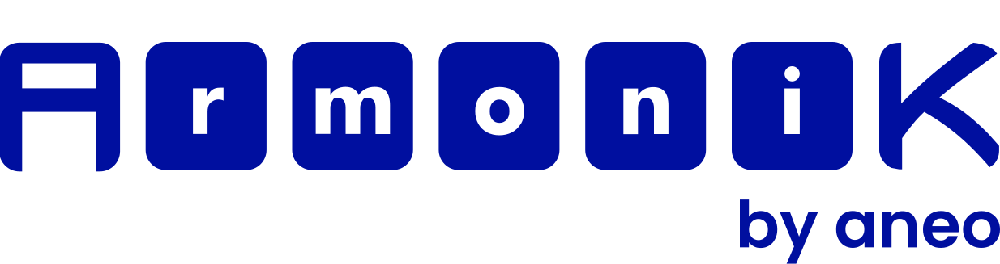

 

**A high-performance, distributed task execution platform designed for compute-intensive workloads in cloud-native environments.**

ArmoniK enables organizations to scale computational workloads from single nodes to massive distributed clusters seamlessly. Built with cloud-native principles, it provides fault-tolerant task orchestration, auto-scaling capabilities, and enterprise-grade monitoring for mission-critical applications. 

[**Read the full documentation**](https://armonik.readthedocs.io/en/latest/) | [**View examples**](https://github.com/aneoconsulting/ArmoniK.Samples/)

While there are many task orchestrators available, ArmoniK stands out by focusing on **modularity and customization**. Different use cases have unique requirements around data transfer patterns, task durations, and computational constraints. ArmoniK doesn't try to be everything to everyone – instead, it provides a flexible foundation that you can adapt to your specific use case. This repository provides a complete reference deployment

**Key advantages:**
- **Modular Architecture**: Pick and choose components that fit your needs
- **Easy extensibility**: Adapt orchestration logic for your specific use case  
- **Cloud-Native Design**: Built from the ground up for modern cloud environments

Moreover, ArmoniK is already being used in production by individuals, researchers and big finance companies, allowing them to run distributed workloads made up of millions of tasks without worrying about the low-level orchestration, data shuffling, or failure recovery mechanisms. 

## Use cases

ArmoniK is suited for any workload that can benefit from **high concurrency** and **task distribution**, including:

* Scientific computation and simulations
* Machine learning pipelines
* Batch analytics pipelines
* Real-time distributed processing
* Risk calculation or combinatorial workloads
* Scalable algorithmic processing (e.g., bioinformatics, Monte Carlo, rendering)

## Architecture

ArmoniK is structured as multiple interconnected projects:

| Project | Description |
|---------|-------------|
| [**ArmoniK.Infra**](https://github.com/aneoconsulting/ArmoniK.Infra) | Infrastructure building blocks and deployment components |
| [**ArmoniK.Core**](https://github.com/aneoconsulting/ArmoniK.Core) | Core orchestration logic and essential system components |
| [**ArmoniK.Api**](https://github.com/aneoconsulting/ArmoniK.Api) | gRPC services and low-level APIs for ArmoniK integration (C#, C++, Rust, Python, Javascript) |
| [**ArmoniK.Samples**](https://github.com/aneoconsulting/ArmoniK.Samples) | Example implementations and use cases |
| [**ArmoniK.Admin.GUI**](https://github.com/aneoconsulting/ArmoniK.Admin.GUI) | Dashboard for monitoring your ArmoniK cluster |
| [**ArmoniK.TaskReRunner**](https://github.com/aneoconsulting/ArmoniK.TaskReRunner) | Debugging tool for rerunning previously submitted and processed tasks locally |
| [**ArmoniK.CLI**](https://github.com/aneoconsulting/ArmoniK.TaskReRunner) | Command-line interface for monitoring and managing ArmoniK clusters. |
| [**...**](https://github.com/aneoconsulting/ArmoniK.TaskReRunner) | ... And more ! |

**Higher level SDKs:**
- [ArmoniK.Extensions.Csharp](https://github.com/aneoconsulting/ArmoniK.Extensions.Csharp) - C# high-level abstractions
- [ArmoniK.Extensions.Cpp](https://github.com/aneoconsulting/ArmoniK.Extensions.Cpp) - C++ bindings
- [PymoniK](https://github.com/aneoconsulting/PymoniK) - Python client library

### **Auto-Scaling & Resource Management**
- Dynamic scaling based on workload demands, shines for preemptible computing resources
- Intelligent resource sharing between applications

### **Multi-Language Support**  
- **gRPC-based architecture** supports multiple programming languages
- **Officially supported:** C#, C++, Python, Rust, Java, and JavaScript
- High-level and low-level API options available

### **Schedule Across Different Resources**
- **Multiple architectures:** x86, ARM, GPUs, etc.
- **Operating systems:** Linux, Windows
- **Environments:** On-premises, cloud, hybrid deployments

### **Fault Tolerance & Reliability**
- Continues functioning when nodes fail
- Task-level error management and recovery
- Robust handling of transient failures
- Battle-tested and used in real-world production environments 

### **Advanced Task Scheduling Features**
- **Sub-tasking:** Scheduling a task graph that evolves during execution. Larger tasks can dynamically be split into smaller tasks 
- **Pipelining:** Downloading the data for the upcoming tasks during task execution to massively improve throughput.
- And more !  

### **Modular Design**
- Swap components without modifying core ArmoniK code
- Customize to suit specific user needs and constraints
- extensible architecture   

## Documentation & Community

- [**Getting Started Guide**](https://armonik.readthedocs.io/en/latest/content/armonik/getting-started.html) - Complete documentation
- [**Community Discussions**](https://github.com/aneoconsulting/ArmoniK/discussions) - Ask questions and share ideas
- [**Issue Tracker**](https://github.com/aneoconsulting/ArmoniK/issues) - Report bugs and request features
- [**Contributing**](CONTRIBUTING.md) - How to contribute to the project

## Acknowledgements

This project was funded by AWS and built upon the HTCGrid project's foundation. We're grateful for their support in making distributed computing more accessible.

## License

This project is licensed under the Apache License, Version 2.0. However, please note that the ArmoniK.Core component is under the AGPL license. See the [LICENSE](LICENSE) file for details.

---

  
**[⭐ Star this repository](https://github.com/aneoconsulting/ArmoniK)** if you find ArmoniK useful!

Made with ❤️ by the ArmoniK team

