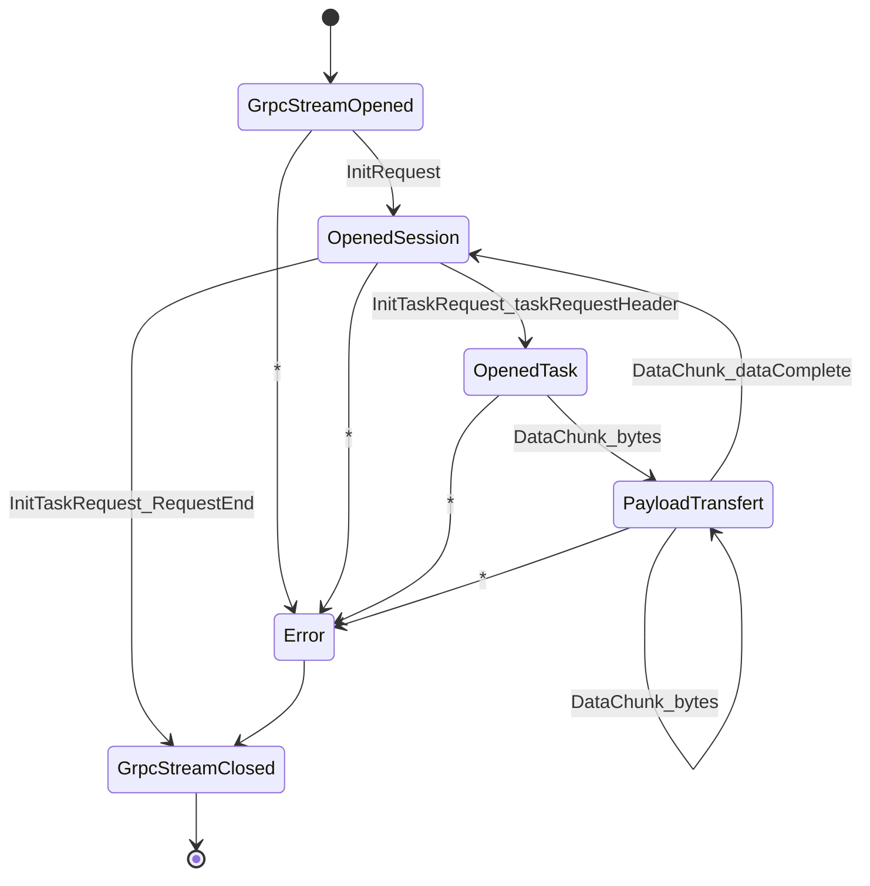

# ClientLargeTasks State Diagram

```mermaid
stateDiagram-v2

    [*] --> GrpcStreamOpened


    GrpcStreamOpened --> OpenedSession:InitRequest

    GrpcStreamOpened --> Error:*


    OpenedSession --> OpenedTask:InitTaskRequest_taskRequestHeader

    OpenedSession --> GrpcStreamClosed:InitTaskRequest_RequestEnd

    OpenedSession --> Error:*


    OpenedTask --> PayloadTransfert:DataChunk_bytes

    OpenedTask --> Error:*


    PayloadTransfert --> PayloadTransfert:DataChunk_bytes

    PayloadTransfert --> OpenedSession:DataChunk_dataComplete

    PayloadTransfert --> Error:*


    Error --> GrpcStreamClosed

    GrpcStreamClosed --> [*]
```
