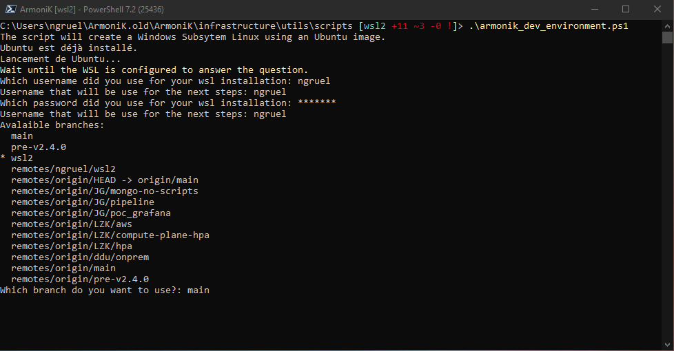

# ArmoniK installation on Windows Subsytem Linux

##Pre-requirements

There are two pre-requisites to be able to use the script to install and test ArmoniK 
on windows:

* Windows Subsystem Linux version 2 (WSL2)
* Powershell Core 7 or greater
* Git to access ArmoniK repository

To install this two requirements (of not already available on your system):

* (WSL2)[https://docs.microsoft.com/en-us/windows/wsl/install]
* (Powershell Core 7)[https://docs.microsoft.com/fr-fr/powershell/scripting/install/installing-powershell-on-windows?view=powershell-7.2]
* Git: 

Another solution, at least for the Powershell and Git installation is to use the (chocolatey package manager)[http://chocolatey.org/].

In addition, for a standalone ArmoniK instance in WSL2 to be able to work, Docker Desktop on Windows should be *deactivated*. 
If it is not the case the script installing ArmoniK will stop.  

When all the requirement are available. It is possible to clone ArmoniK repository and using the powershell script to install a WSL2 version and launch some tests.

## Cloning ArmoniK repository

To clone ArmoniK go to the directory where you want to clone it. If we want to clone it in the main directory of the user: 

```powershell
cd c:\Users\$env:username
git clone https://github.com/aneoconsulting/ArmoniK.git
```

when the project is cloned, go to the directory:

```pwsh
cd C:\Users\$env:username\ArmoniK\ArmoniK\infrastructure\utils\scripts
```

and start the script from a powershell (_pwsh_) terminal:

```pwsh
.\armonik_dev_environment.ps1
```


This will open a new terminal where the Ubuntu linux image configuration (user and password) will be done:


You need to quit this new terminal (`exit` command or close the window). 
The script is asking for the username and the password used in the Linux image and will be necessary to continue the script.


The last question will concern the ArmoniK branch that you want to use in this deployment:



After answering these questions, the installation will be done in the following steps:

1. Installation of the system dependencies in the WSL ubuntu using the script `ubuntu_requirements.sh`
2. Systemd installation. Step only needed on WSL and only possible with the Ubuntu distribution for now.
3. ArmoniK requirement installation
4. ArmoniK installation from the source
5. Run ArmoniK tests

In theory, a new tabulation will open in your default webrowser to access to the logs with (seq)[https://datalust.co/].

## Connection to the WSL

It is possible to access at anytime to the WSL Ubuntu by using the following command (after systemd installation):

```powershell
wsl genie -s
```


