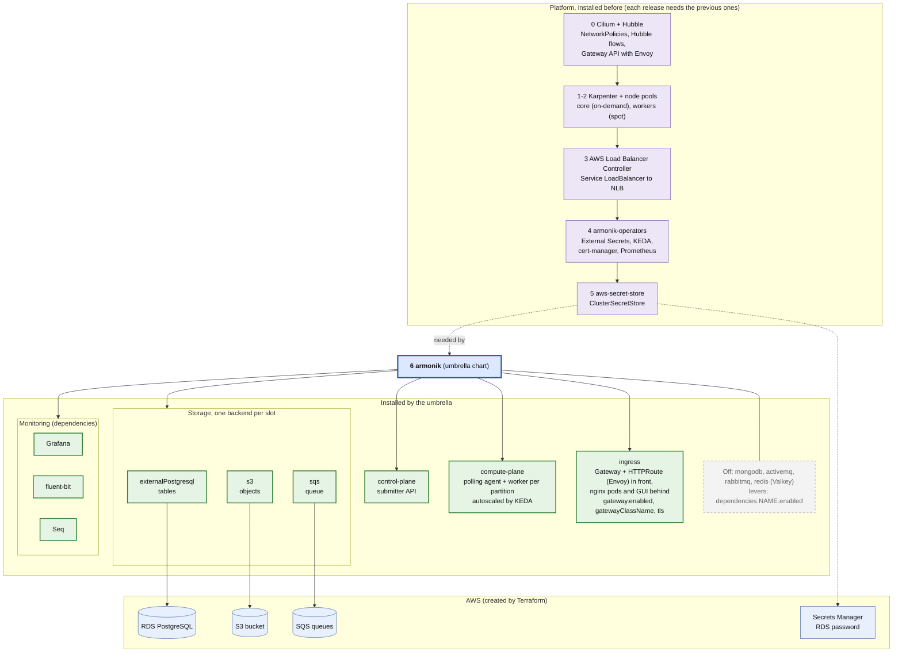

# 1. What gets deployed

ArmoniK on an existing Kubernetes cluster (EKS), with Cilium, Karpenter, RDS PostgreSQL, S3 and SQS. The
`armonik` umbrella chart is on top, what it installs below. The numbers are the install order of the helm releases.

Sources: `ArmoniK.Infra/charts/armonik` and `armonik-operators`, `docs/helm-cli.md`, `docs/examples/values/`.

## The choices

| Choice | What it means | Lever |
|---|---|---|
| **RDS PostgreSQL** | The only table backend. MongoDB and its operator are off; the chart refuses both at once. The password stays in Secrets Manager and reaches the pods through External Secrets. | `dependencies.externalPostgresql.enabled`, `dependencies.mongodb.enabled: false` |
| **S3** | Objects are stored in S3, which survives a restart, unlike Valkey (in memory). No Valkey, so no dedicated `storage` node pool. | `dependencies.s3.enabled`, `dependencies.redis.enabled: false` |
| **SQS** | Core creates the queues under a prefix; ActiveMQ and RabbitMQ stay off. | `dependencies.sqs.enabled` and `prefix` |
| **AWS credentials** | None stored: S3, SQS, EC2 and Secrets Manager are reached with EKS Pod Identity, bound to the service accounts by namespace and name. | `serviceAccount.name` of each chart |
| **Karpenter** | Starts and stops nodes after the pending pods. Compute pods run on the `workers` pool (spot first), the rest on `core`. | `karpenter-nodes` values: `nodePools.*` |
| **Cilium + Hubble** | Enforces NetworkPolicies and shows the flows (Hubble). Helm only: Hubble is a set of values of the Cilium chart. Install it first, so that no pod starts uncovered. | `networkPolicy.enabled`, Cilium `hubble.relay.enabled`, `hubble.ui.enabled` |
| **Envoy in front** | The ingress chart has no "envoy" option: it speaks the Gateway API, and any Envoy-based implementation (the one embedded in Cilium, or Envoy Gateway) plugs in through `gatewayClassName`. The diagram is generic on purpose. With `httpRoute.enabled`, the `armonik` Service becomes a ClusterIP and the routes point to it: Envoy receives the traffic (and the NLB), nginx stays behind it. | `ingress.gateway.*`, `ingress.httpRoute.enabled` |
| **Monitoring** | The chart's own: Prometheus (from the operators, also read by KEDA), Grafana, fluent-bit and Seq. A customer Grafana replaces the chart's with `dependencies.grafana.enabled: false`. | `dependencies.grafana.enabled`, `global.armonik.monitoring.prometheusUrl` |

## To validate with the customer

- **Which Envoy.** The customer already runs Cilium and Envoy: find out if Envoy is Cilium's own or a separate
  install. The Gateway API of Cilium needs `kubeProxyReplacement: true` and the Gateway API CRDs installed
  separately; whether that works with Cilium chained on the VPC CNI (what `docs/examples/values/cilium.yaml`
  does) is not documented, and has to be tested. Envoy Gateway is the independent alternative.
- **Cilium mode.** Chained on the VPC CNI keeps the `vpc-cni` addon of `terraform/eks.tf`: nodes are `Ready`
  before Cilium, and the NLB and Pod Identity are unchanged. Replacing the VPC CNI is possible but heavier
  (nodes `NotReady` until Cilium is up, ENI IPAM, extra IAM rights); it is the case where installing Cilium in the
  Terraform apply, as the customer does, is easier.
- **nginx is not replaced, it is put behind Envoy.** In `armonik-ingress`, the nginx Deployment and its Service are
  rendered whatever `gateway.enabled` says, and the default `HTTPRoute` sends gRPC (by content type) and HTTP to that
  Service. Nginx also serves the GUI and the `/grafana` and `/seq` routes. Getting rid of it means custom
  `httpRoute.rules` straight to the control plane and the GUI, and a chart change to stop rendering nginx: a
  question for the chart maintainers, to check on a `helm template`.
- **The NLB.** The chart exposes no annotation for the Gateway's own Service (`service.annotations` applies to the
  nginx Service, which becomes a ClusterIP). Where the AWS Load Balancer Controller annotations go (the Gateway
  implementation's configuration) depends on the Envoy chosen.
