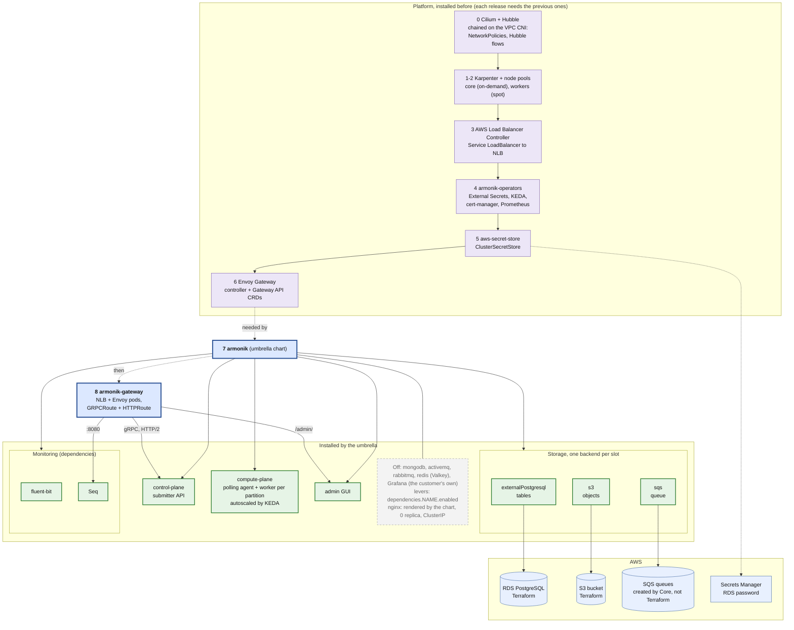
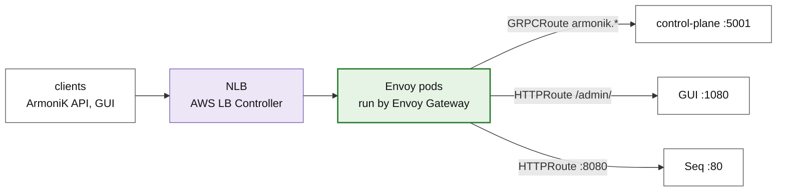

# 1. What gets deployed

ArmoniK on EKS, with Cilium + Hubble, Karpenter, RDS PostgreSQL, S3 and SQS, and Envoy (Envoy Gateway) as the only
ingress. The `armonik` umbrella chart is in the middle, what it installs inside. The numbers are the install order of
the helm releases (README, step 3).

Sources: `ArmoniK.Infra/charts/armonik` and `armonik-operators`, `README.md`, `values/`.

## Envoy as the only ingress

All of it is in the local chart `charts/armonik-gateway`, with no change to ArmoniK.Infra: the `EnvoyProxy` (NLB
annotations, internal or internet-facing), the `GatewayClass` and the `Gateway` (ports 5001, 5000 and 8080, TLS from
cert-manager when enabled), the routes, and the timeouts of the long gRPC streams. The umbrella's nginx is still
rendered, but at 0 replica behind a ClusterIP Service. Its Gateway API objects stay off: the chart only renders an
`HTTPRoute`, with which Envoy would talk HTTP/1.1 to the control plane, and gRPC needs HTTP/2 (`GRPCRoute`).

Why Envoy Gateway and not the Envoy of Cilium: the Gateway API of Cilium needs kube-proxy replacement, which is not
documented with Cilium chained on the VPC CNI. The VPC CNI stays, so that the NLB targets the pod IPs and Pod
Identity works unchanged.

## The choices

| Choice | What it means | Lever |
|---|---|---|
| **RDS PostgreSQL** | The only table backend. MongoDB and its operator are off; the chart refuses both at once. The password stays in Secrets Manager and reaches the pods through External Secrets. | `dependencies.externalPostgresql.enabled`, `dependencies.mongodb.enabled: false` |
| **S3** | Objects are stored in S3, which survives a restart, unlike Valkey (in memory). No Valkey, so no dedicated `storage` node pool. | `dependencies.s3.enabled`, `dependencies.redis.enabled: false` |
| **SQS** | Core creates its queues under a prefix, at runtime. Terraform only provides the prefix and the IAM policy for it. ActiveMQ and RabbitMQ stay off. | `dependencies.sqs.enabled` and `prefix` |
| **AWS credentials** | None stored: S3, SQS, EC2 and Secrets Manager are reached with EKS Pod Identity, bound to the service accounts by namespace and name. | `serviceAccount.name` of each chart |
| **Karpenter** | Starts and stops nodes after the pending pods. Compute pods run on the `workers` pool (spot first), the rest on `core`. | `karpenter-nodes` values: `nodePools.*` |
| **Cilium + Hubble** | Enforces NetworkPolicies and shows the flows (Hubble). Helm only: Hubble is a set of values of the Cilium chart. Installed first; new Karpenter nodes start tainted until the Cilium agent is ready. | `networkPolicy.enabled`, Cilium `hubble.relay.enabled`, `hubble.ui.enabled`, `startupTaints` |
| **Envoy Gateway** | The only entry point: NLB, Envoy, gRPC and HTTP routes. TLS at the Gateway. | `values/armonik-gateway.yaml`: `loadBalancer.scheme`, `tls` |
| **Monitoring** | Prometheus (from the operators, also read by KEDA), fluent-bit and Seq. The customer's own Grafana replaces the chart's (`dependencies.grafana.enabled: false`, see `docs/grafana-dashboards.md`). | `dependencies.grafana.enabled`, `global.armonik.monitoring.prometheusUrl` |

## Still open

- **mTLS.** nginx could demand a client certificate and pass its CN to Core. With Envoy it is a
  `ClientTrafficPolicy` (`tls.clientValidation`), not configured yet.
- **What nginx did and is dropped:** the `/grafana/` proxy, the GUI language from `Accept-Language`, and the
  `/static/` environment banner of the GUI (see `docs/reference.md`).
