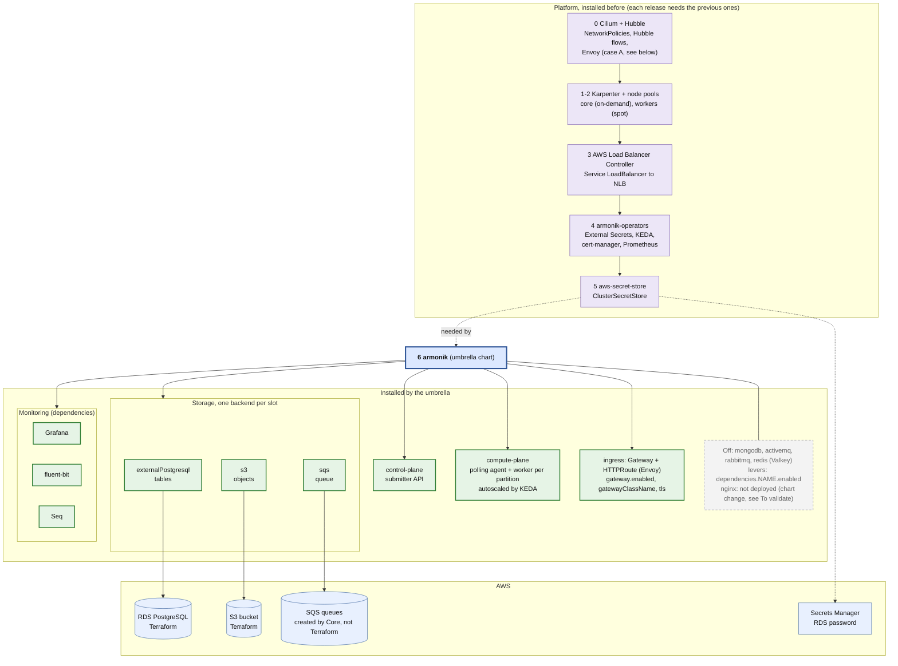
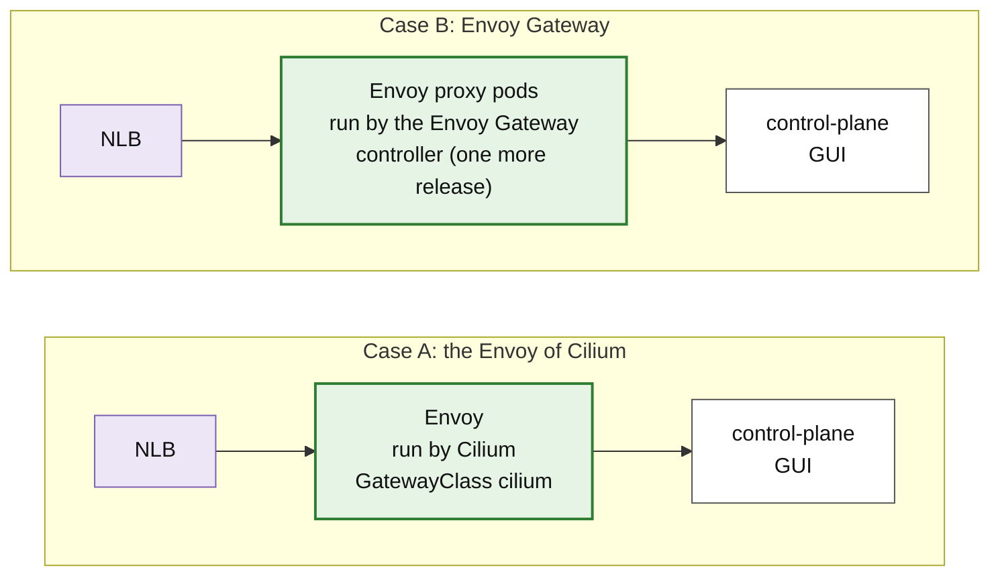

# 1. What gets deployed

ArmoniK on an existing Kubernetes cluster (EKS), with Cilium, Karpenter, RDS PostgreSQL, S3 and SQS, and Envoy as the
only ingress. The `armonik` umbrella chart is on top, what it installs below. The numbers are the install order of
the helm releases.

Sources: `ArmoniK.Infra/charts/armonik` and `armonik-operators`, `docs/helm-cli.md`, `docs/examples/values/`.

## Envoy as the only ingress: two ways to run it

Envoy is the only entry point: no nginx. The ArmoniK side is the same in both cases (`ingress.gateway.*` and an
`HTTPRoute` to the control plane and the GUI); only the platform under it differs.

| | A. Cilium | B. Envoy Gateway |
|---|---|---|
| Extra release | none, Envoy is part of Cilium | the Envoy Gateway chart, installed after Cilium |
| Prerequisites | `kubeProxyReplacement: true`, Gateway API CRDs installed separately | Gateway API CRDs; no constraint on the CNI |
| Cilium mode | to validate: the Gateway API is not documented with Cilium chained on the VPC CNI | chaining or replacement, both fine |
| NLB annotations | not found in the documentation for the Gateway Service: to validate | on the `EnvoyProxy` resource (`envoyService.annotations`) |
| Upgrades | tied to the Cilium version | independent |

Both cases have a single ingress. A is the smaller platform if it works in the Cilium mode retained; B is the safe
fallback, at the price of one more release. Once the customer has decided, only one of the two stays in the docs.

## The choices

| Choice | What it means | Lever |
|---|---|---|
| **RDS PostgreSQL** | The only table backend. MongoDB and its operator are off; the chart refuses both at once. The password stays in Secrets Manager and reaches the pods through External Secrets. | `dependencies.externalPostgresql.enabled`, `dependencies.mongodb.enabled: false` |
| **S3** | Objects are stored in S3, which survives a restart, unlike Valkey (in memory). No Valkey, so no dedicated `storage` node pool. | `dependencies.s3.enabled`, `dependencies.redis.enabled: false` |
| **SQS** | Core creates its queues under a prefix, at runtime. Terraform only provides the prefix and the IAM policy for it. ActiveMQ and RabbitMQ stay off. | `dependencies.sqs.enabled` and `prefix` |
| **AWS credentials** | None stored: S3, SQS, EC2 and Secrets Manager are reached with EKS Pod Identity, bound to the service accounts by namespace and name. | `serviceAccount.name` of each chart |
| **Karpenter** | Starts and stops nodes after the pending pods. Compute pods run on the `workers` pool (spot first), the rest on `core`. | `karpenter-nodes` values: `nodePools.*` |
| **Cilium + Hubble** | Enforces NetworkPolicies and shows the flows (Hubble). Helm only: Hubble is a set of values of the Cilium chart. Install it first, so that no pod starts uncovered. | `networkPolicy.enabled`, Cilium `hubble.relay.enabled`, `hubble.ui.enabled` |
| **Monitoring** | The chart's own: Prometheus (from the operators, also read by KEDA), Grafana, fluent-bit and Seq. A customer Grafana replaces the chart's with `dependencies.grafana.enabled: false`. | `dependencies.grafana.enabled`, `global.armonik.monitoring.prometheusUrl` |

## To validate

- **The chart still deploys nginx.** In `armonik-ingress`, the nginx Deployment and its Service are rendered whatever
  `gateway.enabled` says, and the default `HTTPRoute` points to that Service. "Envoy only" therefore needs a change in
  `ArmoniK.Infra`: do not render nginx when `httpRoute.enabled`, and route straight to the control plane and the GUI
  (`httpRoute.rules` already accepts any `backendRefs`).
- **What nginx does today and Envoy must take over:** gRPC and HTTP routing to the control plane, the GUI, the
  `/grafana` and `/seq` routes, and TLS and mTLS. TLS termination is a Gateway listener; mTLS depends on the
  implementation chosen.
- **Which Envoy the customer runs.** They already have Cilium and Envoy: find out if it is Cilium's own, a separate
  install, or Envoy Gateway. It decides between A and B.
- **Cilium mode.** Chained on the VPC CNI keeps the `vpc-cni` addon of `terraform/eks.tf`: nodes are `Ready` before
  Cilium, the NLB and Pod Identity are unchanged. Replacing the VPC CNI is heavier (nodes `NotReady` until Cilium is
  up, ENI IPAM, extra IAM rights), and is the case where installing Cilium in the Terraform apply, as the customer
  does, is easier.
