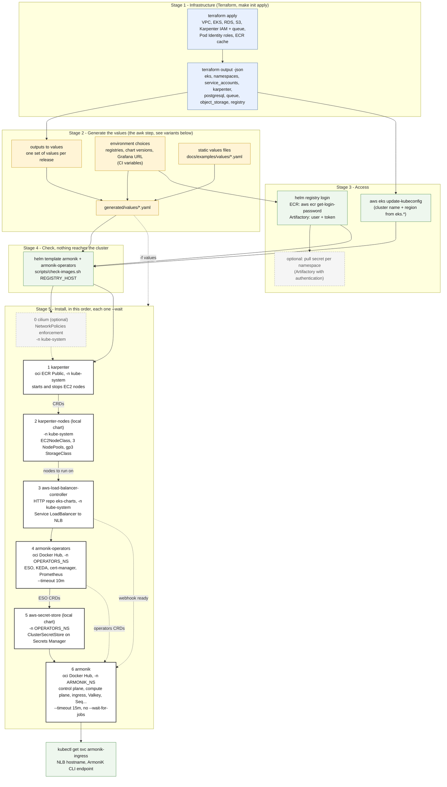
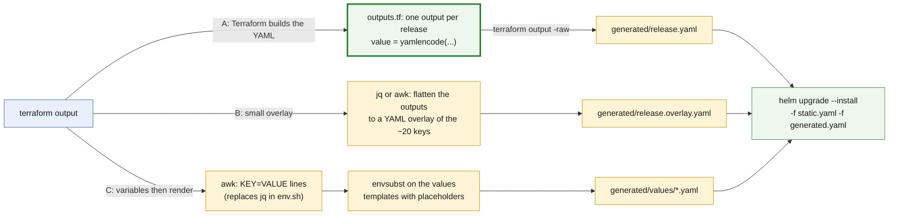

# 1. Deployment pipeline: Terraform outputs to helm releases

What a CI/CD job (Bamboo) does, from the Terraform outputs to the six `helm upgrade --install` of
[helm-cli.md](../helm-cli.md). Only `helm`, `kubectl`, `aws` and Terraform are involved: no helmfile.

## The pipeline

Each release takes its own values file, see [03-values.md](03-values.md). `--install` makes every command safe to
rerun, and `--reuse-values` is never used: the next upgrade would replay old values and ignore the chart's new
defaults. Removal is the same list in reverse, waiting for the NLB after `armonik` and for the Karpenter nodes
after the NodePools.

## Terraform output to values

Source: `terraform/outputs.tf`, and `docs/examples/env.sh` for the variable names. The values files are static
templates: these are the only keys that depend on the infrastructure.

| Terraform output | `env.sh` variable | Values file | Key |
|---|---|---|---|
| `eks.name` | `CLUSTER_NAME` | `karpenter.yaml` | `settings.clusterName` |
| | | `aws-load-balancer-controller.yaml` | `clusterName` |
| | | (also) `aws eks update-kubeconfig --name` | |
| `eks.region` | `AWS_REGION` | `aws-load-balancer-controller.yaml` | `region` |
| | | `aws-secret-store.yaml` | `region` |
| | | `armonik.yaml` | `dependencies.sqs.region`, `dependencies.s3.region` |
| `eks.vpc_id` | `VPC_ID` | `aws-load-balancer-controller.yaml` | `vpcId` |
| `namespaces.operators` | `OPERATORS_NS` | `helm -n` of releases 4 and 5 | |
| | | `armonik.yaml` | `global.armonik.operators.<op>.namespace`, `global.armonik.monitoring.prometheusUrl` |
| `namespaces.armonik` | `ARMONIK_NS` | `helm -n` of release 6, `armonik-registry-auth` secret | |
| `service_accounts.control_plane` | `SA_CONTROL_PLANE` | `armonik.yaml` | `control-plane.serviceAccount.name` |
| `service_accounts.compute_plane` | `SA_COMPUTE_PLANE` | `armonik.yaml` | `compute-plane.serviceAccount.name` |
| `karpenter.queue_name` | `KARPENTER_QUEUE` | `karpenter.yaml` | `settings.interruptionQueue` |
| `karpenter.node_role` | `KARPENTER_NODE_ROLE` | `karpenter-nodes.yaml` | `nodeRole` |
| `karpenter.discovery_tag` | `KARPENTER_DISCOVERY_TAG` | `karpenter-nodes.yaml` | `discoveryTag` |
| `postgresql.host`, `.port`, `.database` | `PG_HOST`, `PG_PORT`, `PG_DATABASE` | `armonik.yaml` | `dependencies.externalPostgresql.{host,port,database}` |
| `postgresql.secret_arn` | `PG_SECRET_ARN` | `armonik.yaml` | `dependencies.externalPostgresql.credentials.secret` |
| `queue.prefix` | `SQS_PREFIX` | `armonik.yaml` | `dependencies.sqs.prefix` |
| `object_storage.bucket` | `S3_BUCKET` | `armonik.yaml` | `dependencies.s3.bucketName` (S3 variant) |
| `registry.upstreams.*` | `REG_DOCKERHUB`, `REG_GHCR`, `REG_QUAY`, `REG_K8S`, `REG_ECR_PUBLIC` | all files | every `image.registry` / `image.repository` |
| `registry.host` | none: `env.sh` does not read it, helm-cli.md derives `REGISTRY_HOST=${REG_DOCKERHUB%%/*}` | `helm registry login`, `check-images.sh` | |

Not outputs, but injected the same way: `CHARTS_DOCKERHUB`, `CHARTS_ECR_PUBLIC`, `EKS_CHARTS_URL` (where the charts are
pulled from), the chart versions (`--version`, never in a values file) and `GRAFANA_URL` (`ingress.grafana_url`).
`eks.endpoint` and `kubeconfig_command` are not read by any values file.

Names that are **not free**: the service accounts, `external-secrets`, `karpenter` and `aws-load-balancer-controller`
are bound to IAM roles by EKS Pod Identity, by namespace and name (`terraform/identities.tf`). A pipeline that
renames one of them leaves the pod without AWS credentials.

## Variants of the "outputs to values" step

The format is not decided. The values to produce split in two kinds, which do not have the same best source:

- **Infrastructure facts** (names, ARNs, hosts, prefixes): about 20 keys in total, all in the table above.
  They come from Terraform.
- **Environment choices** (registry prefixes, chart versions, Grafana URL): they do not come from Terraform when the
  registry is the customer's Artifactory. They are CI variables. The registry prefixes are the awkward part: about
  35 occurrences across `armonik.yaml` and `armonik-operators.yaml`, because `global.imageRegistry` is not honoured
  by every dependency (Valkey and Seq among them).

| | A: Terraform `yamlencode` | B: static files + generated overlay | C: awk variables + envsubst (current flow) |
|---|---|---|---|
| awk needed | no | optional (jq does it better) | yes, replaces the `jq` calls of `env.sh` |
| Static values files | valid YAML, no placeholder | valid YAML, no placeholder | templates, invalid until rendered |
| Infra values can drift from the resources | no, built in the same Terraform run | possible | possible |
| Registry prefixes | CI overlay, or set in Terraform | CI overlay | `${REG_*}` placeholders, as today |
| Change to the pipeline when an output is added | an `outputs.tf` edit | edit the flatten step | edit `env.sh` and the `ENVSUBST_VARS` list |
| Risk | Terraform owns Helm key names | awk or jq on nested JSON | an unfilled `${VAR}` reaches helm (`grep -l '\${'` guards it) |

Recommendation: **A for the infrastructure facts, plus a small CI overlay for the environment choices** (registries,
versions, Grafana URL), layered with `-f`, the generated file after the static one. If the customer imposes awk, B is
the least fragile: it keeps the static files valid on their own, and awk only produces the short overlay. C is what
`docs/examples` does today and works as is, with `awk` in place of `jq`.
