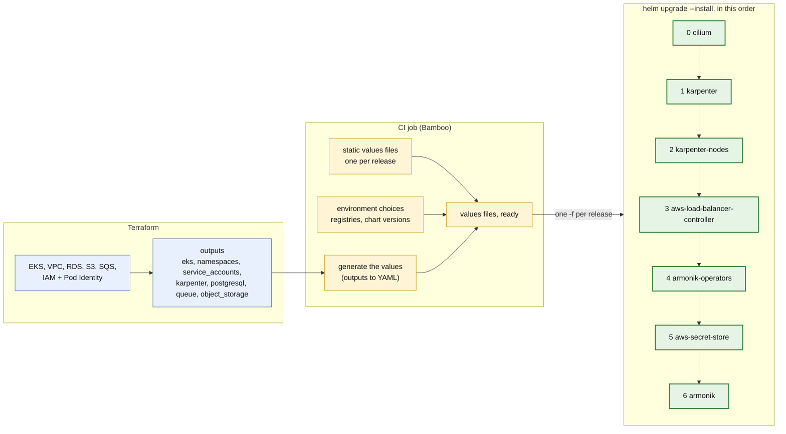

# 2. From Terraform to the helm releases

Terraform creates the AWS side and prints its outputs. A CI step turns them into values files, and `helm` installs
the releases in order. No helmfile.

## Which output feeds which release

| Terraform output | Feeds | Key |
|---|---|---|
| `eks` (name, region, vpc_id) | 1 karpenter, 3 load balancer controller, 5 secret store | cluster name, region, VPC id |
| `karpenter` (node role, queue, discovery tag) | 1 karpenter, 2 karpenter-nodes | `interruptionQueue`, `nodeRole`, `discoveryTag` |
| `namespaces`, `service_accounts` | 4, 5, 6 | `-n`, and `serviceAccount.name` of the control plane and compute plane |
| `postgresql` (host, port, database, secret ARN) | 6 armonik | `dependencies.externalPostgresql.*` |
| `queue` (prefix) | 6 armonik | `dependencies.sqs.prefix` |
| `object_storage` (bucket) | 6 armonik | `dependencies.s3.bucketName` |

Not Terraform outputs: the registry prefixes and the chart versions are CI variables, and the Gateway class depends on
the Envoy chosen. Everything is read from `docs/examples/env.sh` and `terraform/outputs.tf`.

## The "generate the values" step

The format is not decided, and it does not need to be: the step only has to produce the ~15 keys above.

- **Best: Terraform writes the YAML itself.** One output per release built with `yamlencode(...)`, then
  `terraform output -raw` to a file. No awk, and the values cannot drift from the resources.
- **If awk is imposed:** keep the static files valid on their own and let awk write a short overlay of the keys
  above, passed as the last `-f`. The overlay is small, so it stays readable and easy to review.
- **Today's flow** (`env.sh` + `envsubst`) works as is: awk can replace its `jq` calls.

Registry prefixes are the awkward part, repeated on most images because `global.imageRegistry` is not honoured by every
dependency. They belong in the CI variables, not in Terraform.

## Order and why

Each release needs the previous ones to be ready, hence `--wait`:

1. **Cilium** first, so that no pod starts outside the policies. It needs the Gateway API CRDs if its Gateway is used.
2. **Karpenter**, then its node pools: without them nothing else can be scheduled.
3. **Load balancer controller**: it must exist before a `Service` of type `LoadBalancer` is created.
4. **Operators**, then the **secret store**: both bring CRDs (External Secrets, KEDA, cert-manager) that the `armonik`
   release uses.
5. **armonik**, last. No `--wait-for-jobs`: the init Jobs delete themselves, and helm would fail on them.

Details and the commands: [../helm-cli.md](../helm-cli.md).
