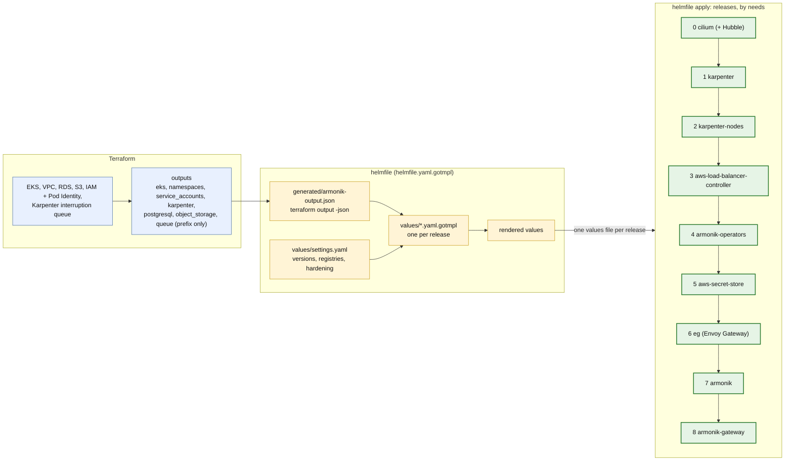

# 2. From Terraform to the helm releases

Terraform creates the AWS side and prints its outputs. helmfile reads them as its environment values, renders one
values file per release, and installs the releases in the order of their `needs`.

## Which output feeds which release

| Terraform output | Feeds | Key |
|---|---|---|
| `eks` (name, region, vpc_id) | 1 karpenter, 3 load balancer controller, 5 secret store | cluster name, region, VPC id |
| `karpenter` (node role, queue, discovery tag) | 1 karpenter, 2 karpenter-nodes | `interruptionQueue`, `nodeRole`, `discoveryTag` |
| `namespaces`, `service_accounts` | 4, 5, 7, 8 | release namespaces, and `serviceAccount.name` of the control plane and compute plane |
| `postgresql` (host, port, database, secret ARN) | 7 armonik | `dependencies.externalPostgresql.*` |
| `queue` (prefix) | 7 armonik | `dependencies.sqs.prefix` (Core creates the queues itself) |
| `object_storage` (bucket) | 7 armonik | `dependencies.s3.bucketName` |

Not Terraform outputs: chart versions, registry overrides (Artifactory) and the hardening switch, in `values/settings.yaml`.
The outputs themselves are defined in `terraform/outputs.tf`.

SQS: Terraform creates no ArmoniK queue. It only creates the queue Karpenter reads its spot interruptions from, and
grants the Pod Identity role of the control plane and compute plane the right to create and use queues under the
prefix. The queues appear when Core starts.

## How helmfile builds the values

`helmfile.yaml.gotmpl` loads two layers of environment values, the Terraform outputs then `values/settings.yaml`, and
renders `values/<release>.yaml.gotmpl` with them. The registry of every image is the ECR pull-through cache of the
outputs, unless `registries` in `settings.yaml` names another one; the prefixes are repeated on most images because
`global.imageRegistry` is not honoured by every dependency. `hardening` and `registryAuth` add the layers
`armonik-hardening.yaml.gotmpl` and `armonik-registry-auth.yaml.gotmpl`, and switch the NLB, TLS and pull secrets of
the other releases.

## Order and why

Each release `needs` the previous one, and helmfile waits for it (`helmDefaults.wait`):

1. **Cilium** first, so that no pod starts outside the policies. Karpenter nodes then start tainted until its agent
   is ready. Not waited for (Hubble needs a core node): a `postsync` hook waits for its agents instead.
2. **Karpenter**, then its node pools: without them nothing else can be scheduled.
3. **Load balancer controller**: it must exist before a `Service` of type `LoadBalancer` is created.
4. **Operators**, then the **secret store**: both bring CRDs (External Secrets, KEDA, cert-manager) that the `armonik`
   release uses.
5. **Envoy Gateway**: the controller and the Gateway API CRDs.
6. **armonik**. No `waitForJobs`: the init Jobs delete themselves, and helm would fail on them.
7. **armonik-gateway**, last: its routes point to the Services of `armonik`.

The commands are in the [README](../../README.md#3-helmfile), step 3.
