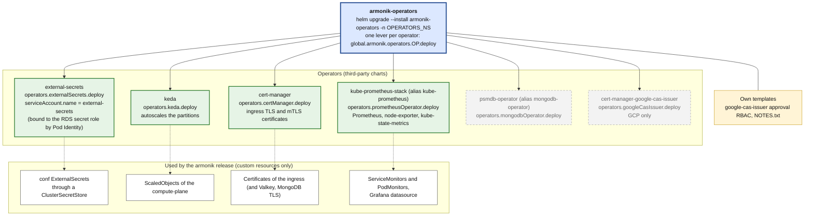

# 2. The umbrella charts and what they call

Two umbrellas matter: **`armonik`** (the application) and **`armonik-operators`** (the install-once cluster
operators). Both come from `ArmoniK.Infra/charts` and are pulled as OCI charts. The diagrams read top to bottom: the
umbrella, the subcharts it declares in `Chart.yaml`, then the third-party charts and configuration fragments below.

Legend: solid green = installed in the customer scenario of `docs/examples/values/armonik.yaml`; dashed grey =
available in the chart, off in this scenario (the lever to turn it on is in the node); yellow = configuration
fragment rendered by the umbrella, no chart installed.

## `armonik`

```mermaid
flowchart TD
    classDef umb fill:#dce8ff,stroke:#2f5597,stroke-width:3px,color:#111
    classDef on fill:#e6f4e6,stroke:#2e7d32,stroke-width:2px,color:#111
    classDef off fill:#f3f3f3,stroke:#9e9e9e,stroke-dasharray:5 4,color:#666
    classDef frag fill:#fff4d6,stroke:#c79a1b,color:#111
    classDef lib fill:#ece6f7,stroke:#7a5cb0,color:#111

    U["<b>armonik</b> (umbrella)<br/>helm upgrade --install armonik -n ARMONIK_NS<br/>levers: nameOverride, fullnameOverride, namespaceOverride<br/>global.armonik.versions.core and .gui, imageRegistry, imagePullSecrets"]:::umb

    OWN["Own templates of the umbrella<br/>conf layers: Secrets release-conf-* (ExternalSecrets)<br/>secret-store: ServiceAccount + SecretStore per namespace<br/>urls Secret, certificates<br/>NetworkPolicies (networkPolicy.enabled)<br/>Grafana datasource + dashboards ConfigMaps<br/>guards: operators, namespaces, validate"]:::frag
    U --- OWN

    subgraph T1["Subcharts declared in Chart.yaml"]
        direction LR
        COMMON["armonik-common (library)<br/>global.armonik defaults imported by every chart:<br/>mountPath, source, versions, monitoring, operators"]:::lib
        OPS["operators (alias of armonik-operators)<br/>global.armonik.operators.OP.deploy: false<br/>installed by the separate release, see below"]:::off
        CP["control-plane<br/>submitter API, metrics-exporter, init Job<br/>enabled, defaultPartition, extraPartitions,<br/>init.enabled, serviceAccount.name, image.registry"]:::on
        COMP["compute-plane<br/>polling-agent + worker per partition, KEDA<br/>enabled, partitions.NAME, partitionCommon<br/>(nodeSelector, tolerations, hpa.maxReplicaCount,<br/>agent/worker resources and image), serviceAccount.name"]:::on
        ING["ingress<br/>nginx gRPC/HTTP, Admin GUI<br/>enabled, service.annotations (NLB), tls, mtls,<br/>grafana_url, loadBalancer, gateway, httpRoute"]:::on
        DEP["dependencies (armonik-dependencies)<br/>storage and observability backends<br/>one toggle per backend"]:::on
    end
    U --> COMMON
    U --> OPS
    U --> CP
    U --> COMP
    U --> ING
    U --> DEP

    subgraph T2["Under dependencies: storage"]
        direction LR
        PG["externalPostgresql (fragment)<br/>RDS: enabled, host, port, database, ssl,<br/>credentials.secret + storeName/storeKind<br/>exclusive with mongodb"]:::frag
        SQS["sqs (fragment)<br/>enabled, region, prefix"]:::frag
        VK["redis (chart valkey)<br/>enabled, resources, valkeyConfig,<br/>nodeSelector, tolerations, tls, auth"]:::on
        S3["s3 (fragment)<br/>enabled, region, bucketName<br/>alternative to redis for objects"]:::off
        MONGO["mongodb (chart psmdb-db, Percona)<br/>mongodb.enabled, replsets.rs0.size, tls<br/>needs operators.mongodbOperator"]:::off
        MEXP["mongodb-exporter<br/>mongodb-exporter.enabled"]:::off
        AMQ["activemq (local chart)<br/>activemq.enabled"]:::off
        RMQ["rabbitmq (chart bitnami)<br/>rabbitmq.enabled"]:::off
        GCP["gcs, pubsub (fragments)<br/>not used on AWS"]:::off
    end
    subgraph T3["Under dependencies: observability"]
        direction LR
        GRAF["grafana (chart grafana)<br/>grafana.enabled<br/>off here: the customer runs its own,<br/>ingress.grafana_url points to it"]:::off
        FB["fluent-bit (chart fluent-bit)<br/>fluent-bit.enabled, image, tolerations"]:::on
        SEQ["seq (chart seq)<br/>seq.enabled, image, firstRunAdminPasswordHash"]:::on
    end
    DEP --> PG
    DEP --> SQS
    DEP --> VK
    DEP --> S3
    DEP --> MONGO
    DEP --> MEXP
    DEP --> AMQ
    DEP --> RMQ
    DEP --> GCP
    DEP --> GRAF
    DEP --> FB
    DEP --> SEQ
```

The table, queue and object slots are **one backend each**: the chart refuses to render with `mongodb` and
`externalPostgresql` both enabled. `s3` and `redis` are the two object stores. `sqs`, `activemq` and `rabbitmq` are
the queues.

Sources: `ArmoniK.Infra/charts/armonik/Chart.yaml`, `armonik/values.yaml`, `armonik/templates/storage/*`,
`armonik-dependencies/Chart.yaml`, and the values of `docs/examples/values/armonik.yaml`.

## `armonik-operators`

Installed once per cluster, in its own namespace, ahead of the application release. `helm uninstall armonik` can then
never delete a CRD, and with it every custom resource of the cluster.

How the two releases agree: the operators release **installs** an operator when its `deploy` is true. The `armonik`
release is told the operator exists with `available: true` and `deploy: false`, plus its `namespace`: that is what
the umbrella's `operators-guard.yaml` checks, and it fails on `deploy: true` with `available: false`. A cluster
that already has an operator takes the same values with no `armonik-operators` release for it.
`global.armonik.monitoring.prometheusUrl` must name the Prometheus of this stack, or the customer's own.

In the customer scenario, `mongodbOperator`, `postgresqlOperator` (RDS replaces it) and `googleCasIssuer` are off in
both releases.

Sources: `ArmoniK.Infra/charts/armonik-operators/Chart.yaml`, `armonik/templates/operators-guard.yaml`,
`docs/examples/values/armonik-operators.yaml`.
