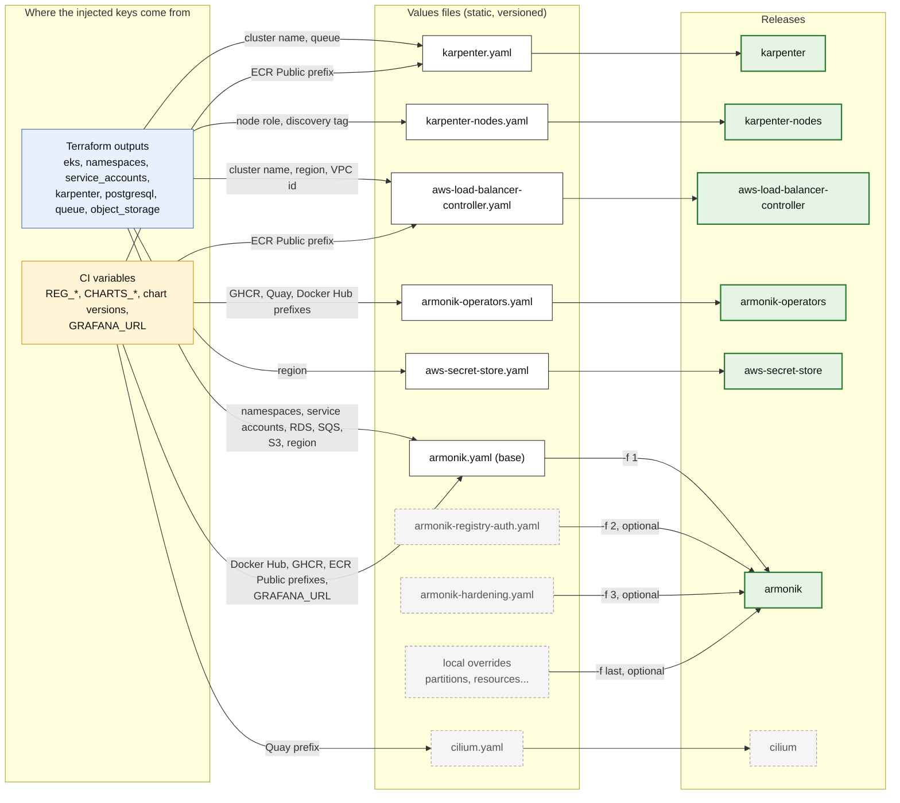
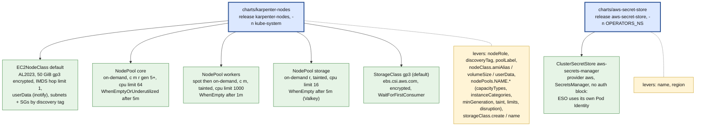

# 3. Values files: what feeds which release

One values file per release, from `docs/examples/values/`. Each is a static file in which only a few keys are
injected: the infrastructure facts from the Terraform outputs, and the environment choices from CI variables
(see [01-pipeline.md](01-pipeline.md#terraform-output-to-values)).

## Sources, files, releases

The `armonik` release takes up to four `-f`, merged in order: later files win, maps merge key by key, and a list
replaces the one before. A layer therefore only holds what changes. In the CI job a generated overlay (variant A or B
of the pipeline) is simply another `-f`.

## What each file contains

| Values file | Static content (versioned) | Injected |
|---|---|---|
| `karpenter.yaml` | controller resources, `nodeSelector` on the `system` node group | `settings.clusterName`, `settings.interruptionQueue`, `controller.image.repository` |
| `karpenter-nodes.yaml` | nothing by default, the defaults are in `charts/karpenter-nodes/values.yaml` | `nodeRole`, `discoveryTag` |
| `aws-load-balancer-controller.yaml` | `keepTLSSecret`, service account name | `clusterName`, `region`, `vpcId`, `image.repository` |
| `armonik-operators.yaml` | which operators are off, per-subchart resources and settings | `OPERATORS_NS`, every image registry (about 17) |
| `aws-secret-store.yaml` | store name `aws-secrets-manager` | `region` |
| `armonik.yaml` | operators `available`, partitions, `partitionCommon` (node pool, resources, `hpa.maxReplicaCount`), NLB annotations, which dependencies are on | namespaces, service accounts, `externalPostgresql.*`, `sqs.*`, `s3.*`, `grafana_url`, every image registry (about 18) |
| `armonik-registry-auth.yaml` | pull secret name per chart family | `ARMONIK_NS` (in its header only) |
| `armonik-hardening.yaml` | internal NLB, `tls`, `mtls`, `networkPolicy.enabled` | none (`extraDnsNames` is a per-environment choice) |
| `cilium.yaml` | chaining mode and routing | Quay prefix |

## Local charts

Two of the six releases are charts of this repository, with their own defaults.

The `workers` pod placement is the contract between the two charts: `armonik.yaml` selects and tolerates
`armonik.aneo.fr/node-pool: workers` (compute plane) and `storage` (Valkey), which `poolLabel` and `taint` create.

## Choices and where they are set

| Choice | Keys in `armonik.yaml` | Related |
|---|---|---|
| Table storage | `dependencies.externalPostgresql.enabled` (RDS), or `dependencies.mongodb.enabled` | exclusive; MongoDB also needs `operators.mongodbOperator` |
| Queue | `dependencies.sqs.enabled`, `activemq.enabled`, `rabbitmq.enabled` | one at a time; the SQS IAM policy covers `<prefix>*` |
| Object storage | `dependencies.redis.enabled` (Valkey), or `dependencies.s3.enabled` | Valkey is in memory and lost with the pod |
| Autoscaling | `compute-plane.partitionCommon.hpa.maxReplicaCount`, per-partition `hpa` | KEDA, from the operators release |
| Compute sizing | `partitionCommon.agent/worker.resources`, `partitions.NAME.worker.*` | `requests == limits` gives Guaranteed pods and exact Karpenter sizing |
| Node placement | `nodeSelector`, `tolerations` on `partitionCommon` and `redis` | pools of `karpenter-nodes` |
| Ingress | `ingress.service.annotations`, `ingress.tls`, `ingress.mtls` | internal vs internet-facing in `armonik-hardening.yaml` |
| Grafana | `dependencies.grafana.enabled`, `ingress.grafana_url` | disabled: no datasource or dashboard ConfigMaps rendered |
| Prometheus | `global.armonik.monitoring.prometheusUrl` | the operators' stack, or the customer's |
| Image tags | `global.armonik.versions.core`, `.gui` | empty follows the chart's `appVersion` |
| NetworkPolicies | `networkPolicy.enabled` | needs a CNI that enforces them, or `cilium` |
