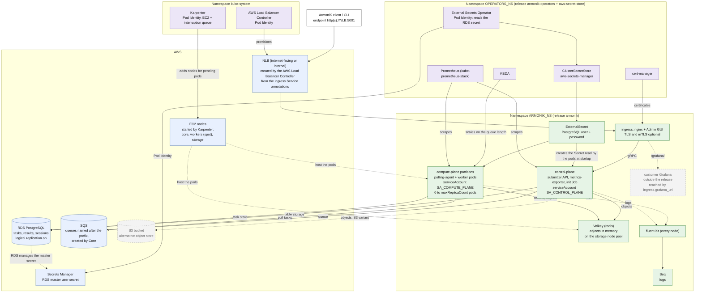

# 4. Runtime: what talks to what once deployed

The customer scenario of `docs/examples/values/armonik.yaml`: RDS PostgreSQL for the tasks, Valkey for the objects,
SQS for the queue, the operators' Prometheus, the customer's own Grafana. Dashed grey = off here.

## What to read from it

- **AWS credentials never reach a Secret.** The AWS APIs (S3, SQS, EC2, Secrets Manager, the load balancer API) are
  called with EKS Pod Identity, by namespace and service account name. This is why `SA_CONTROL_PLANE`,
  `SA_COMPUTE_PLANE`, `external-secrets`, `karpenter` and `aws-load-balancer-controller` are contracts with
  Terraform. The one secret is the RDS master password, which stays in Secrets Manager and reaches the pods through
  the External Secrets Operator.
- **Pods read the RDS password at startup.** After a rotation (`rds.password_rotation_days`, 365 by default) ESO
  refreshes the Kubernetes Secret within the hour, but the control plane and compute plane must be restarted.
- **The compute plane starts at zero pods.** KEDA scales a partition on its queue, Karpenter adds `workers` nodes
  for the pending pods, and removes them when empty.
- **Valkey holds every object in memory, with no persistence.** It runs on the tainted `storage` pool, and a restart
  loses the objects. The S3 variant (`redis.enabled: false`, `s3.enabled: true`) keeps them.
- **PostgreSQL connections scale with the pods.** Every control-plane and polling-agent pod has its own pool
  (`PostgreSQL__MaxPoolSize`, 100 by default): at 50 pods per partition, RDS `max_connections` is the limit.

Sources: `docs/helm-cli.md` (customer scenario, advice), `docs/examples/values/armonik.yaml`, `terraform/outputs.tf`,
`README.md` ("Known limits").
