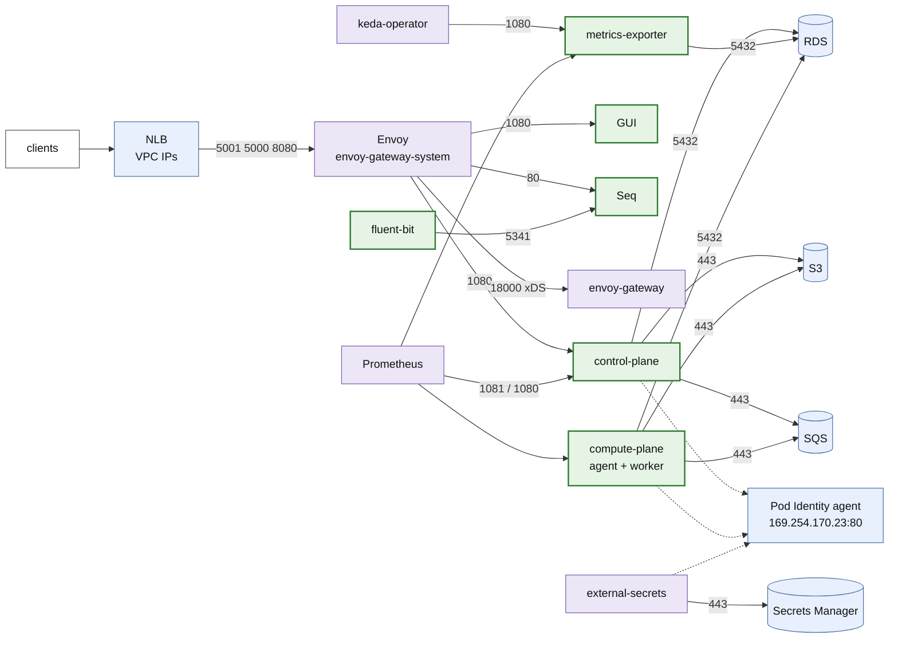

# Network flows

Every connection the deployment of this quick deploy opens, as seen by Hubble, to write NetworkPolicies for a
production environment. Each row says who opens the connection, to what, on which port, and why. Replies are not
listed: a NetworkPolicy allows them by itself.

Captured on 2026-10-06 on `armonik-demo` (chart `0.16.1-SNAPSHOT.4.sha.d640d96c`, Core
`0.42.0-refactorrenamepostgresqladapto.26.sha.4f4d363d`, Cilium 1.20.2), with no NetworkPolicy applied, over:
the idle cluster, an htcmock run (500 tasks, KEDA up to 50 pods, Karpenter up to 6 `workers` nodes, then back to 0), the GUI
and Seq through the NLB, and a forced resync of the `armonik-conf-core` ExternalSecret. **Seen** means present in the
capture. **Config** means expected from the configuration but not seen in that window (a rare or one-off flow).

## Overview



Not drawn: DNS (every pod → CoreDNS), the Kubernetes API (operators, fluent-bit), kubelet probes, Prometheus
scraping the nodes, and the hostNetwork pods (below).

## Into the cluster

| From | To | Port | Why | |
|---|---|---|---|---|
| NLB (VPC IPs, `10.0.0.0/16`) | Envoy `gateway.envoyproxy.io/owning-gateway-name=armonik` | TCP 5001, 5000, 8080 | ArmoniK API (gRPC), GUI, Seq; and the NLB health checks on the same ports. `nlb-target-type: ip` without client IP preservation: the source is the NLB, not the client | Seen |

With client IP preservation on, the sources become the clients' addresses: allow their CIDRs instead.

## Namespace `armonik`

Selectors: control-plane `app.kubernetes.io/component=control-plane`, metrics-exporter
`app.kubernetes.io/component=metrics-exporter`, compute-plane (all partitions) `app.kubernetes.io/part-of=compute-plane`
(one partition: `armonik.fr/partition=<name>`), init Jobs `app.kubernetes.io/component=init`, GUI
`app.kubernetes.io/component=gui`, Seq `app=seq`, fluent-bit `app.kubernetes.io/name=fluent-bit`.

| From | To | Port | Why | |
|---|---|---|---|---|
| Envoy | control-plane | TCP 1080 | GRPCRoute `armonik.*` (Service 5001 → container `control-port`) | Seen |
| Envoy | GUI | TCP 1080 | HTTPRoute `/admin/` | Seen |
| Envoy | Seq | TCP 80 | HTTPRoute on the `seq` listener (Seq UI and API) | Seen |
| control-plane | RDS | TCP 5432 | Table storage, TLS (`rds.force_ssl=1`) | Seen |
| control-plane | S3 | TCP 443 | Payloads and results (`S3__EndpointUrl`), through the S3 gateway endpoint: S3 public IPs | Seen |
| control-plane | SQS | TCP 443 | Submits tasks (`SQS__ServiceURL`) | Seen |
| control-plane | Pod Identity agent `169.254.170.23` | TCP 80 | AWS credentials for S3/SQS (refreshed rarely: not in the window) | Config |
| metrics-exporter | RDS | TCP 5432 | Counts the queued tasks per partition | Seen |
| compute-plane | RDS | TCP 5432 | Task status, results | Seen |
| compute-plane | S3 | TCP 443 | Payloads and results | Seen |
| compute-plane | SQS | TCP 443 | Polls its partition's queue, submits subtasks | Seen |
| compute-plane | Pod Identity agent `169.254.170.23` | TCP 80 | AWS credentials, at each pod start | Seen |
| init Jobs (control-plane, compute-plane) | RDS, S3, SQS, Pod Identity agent | TCP 5432, 443, 443, 80 | `InitServices__Init{Database,ObjectStorage,Queue}`: schema, bucket check, queues, roles. Runs at each `helm install/upgrade` only | Config |
| fluent-bit | Seq | TCP 5341 | Logs (Service `armonik-seq-ingestion`) | Seen |
| fluent-bit | Kubernetes API | TCP 443 | `kubernetes` filter (pod metadata). New connections, not kept alive: a few per minute when idle, about 2,000 per minute while the 50 htcmock pods started | Seen |
| GUI, Seq | - | - | No egress seen, DNS aside | Seen |

**Not seen:** compute-plane → control-plane. With these adapters, the agent talks to RDS, S3 and SQS directly. The
chart's rule that admits the compute-plane into the control-plane (1080) has no use here.

Every pod above also resolves names: UDP and TCP 53 to `kube-system/coredns` (`k8s-app=kube-dns`).

## Namespace `armonik-operators`

| From | To | Port | Why | |
|---|---|---|---|---|
| keda-operator | metrics-exporter (`armonik`) | TCP 1080 | The partitions' `ScaledObject`s use the `metrics-api` trigger on `armonik-control-plane-metrics-exporter:9419/metrics`, **not Prometheus** | Seen |
| keda-operator-metrics-apiserver | keda-operator | TCP 9666 | gRPC between KEDA's components | Seen |
| Kubernetes API | keda-operator-metrics-apiserver | TCP 6443 | External metrics API (the HPA reads it) | Seen |
| Kubernetes API | external-secrets-webhook | TCP 10250 | Admission webhook | Seen |
| Kubernetes API | keda-admission-webhooks (9443), cert-manager-webhook (10250) | | Admission webhooks, when their objects change | Config |
| external-secrets | Secrets Manager | TCP 443 | RDS password (`ClusterSecretStore aws-secrets-manager`), every hour (`refreshInterval: 1h`) | Seen |
| external-secrets | Pod Identity agent | TCP 80 | AWS credentials | Seen |
| Prometheus | control-plane | TCP 1081 | PodMonitor `armonik-control-plane-control-plane` (`metrics-port`) | Seen |
| Prometheus | metrics-exporter | TCP 1080 | ServiceMonitor | Seen |
| Prometheus | compute-plane | TCP 1080 | PodMonitor `armonik-compute-plane-compute-plane` | Seen |
| Prometheus | cert-manager (all 3), kube-state-metrics, keda-operator-metrics-apiserver, the Prometheus operator | TCP 9402, 8080, 8080, 10250 | ServiceMonitors of `armonik-operators` | Seen |
| Prometheus | CoreDNS | TCP 9153 | ServiceMonitor | Seen |
| Prometheus | every node | TCP 9100, 10249, 10250 | node-exporter (hostNetwork), kube-proxy, kubelet/cAdvisor. For a while after a scale-down, Prometheus still scrapes the gone pods and nodes: Hubble shows them as `world` addresses of the VPC | Seen |
| every operator (cert-manager ×3, external-secrets ×2, KEDA ×3, kube-state-metrics, the Prometheus operator, Prometheus) | Kubernetes API | TCP 443 | Controllers, service discovery | Seen |

## Namespace `envoy-gateway-system`

| From | To | Port | Why | |
|---|---|---|---|---|
| Envoy | envoy-gateway | TCP 18000 | xDS configuration | Seen |
| envoy-gateway | Kubernetes API | TCP 443 | Watches Gateway API objects, creates the Envoy Deployment and Service | Seen |

## Namespace `kube-system` (add-ons with a pod IP)

| From | To | Port | Why | |
|---|---|---|---|---|
| karpenter | Kubernetes API | TCP 443 | | Seen |
| karpenter | EC2 API (`ec2.eu-west-3.amazonaws.com`) | TCP 443 | Launch and terminate nodes | Seen |
| karpenter | SQS | TCP 443 | Interruption queue (spot) | Seen |
| karpenter | `us-east-1` EC2 range | TCP 443 | Pricing API (`api.pricing.us-east-1.amazonaws.com`) | Seen |
| karpenter | SSM, IAM, Pod Identity agent | TCP 443, 443, 80 | AMI lookup, instance profiles, credentials (at startup and on change) | Config |
| aws-load-balancer-controller | Kubernetes API | TCP 443 | | Seen |
| aws-load-balancer-controller | ELB, EC2 APIs, Pod Identity agent | TCP 443, 80 | Reconciles the NLB (on Service change) | Config |
| Kubernetes API | aws-load-balancer-controller | TCP 9443 | Webhooks (Service, pod readiness gate) | Config |
| CoreDNS | VPC resolver (`10.0.0.2`) | UDP 53 | Names outside the cluster | Seen |
| CoreDNS | Kubernetes API | TCP 443 | | Seen |
| hubble-ui | hubble-relay | TCP 4245 | | Seen |
| hubble-relay | every node | TCP 4244 | Hubble server of each Cilium agent | Seen |

## Outside NetworkPolicies

- **hostNetwork pods** (`aws-node`, `cilium`, `cilium-envoy`, `ebs-csi-node`, `eks-pod-identity-agent`,
  `prometheus-node-exporter`) and the **kubelet** (image pulls from ECR or Artifactory, S3 for the ECR layers, EKS
  API) run with the node's address: a NetworkPolicy does not select them. Filter them with the node security group,
  or a `CiliumClusterwideNetworkPolicy` with `nodeSelector` (Cilium's host firewall, not enabled here).
- **kubelet probes** (host → every pod: control-plane 1081, metrics-exporter 1080, compute-plane 1080, fluent-bit
  2020, Seq 80, the operators' health ports...). Cilium lets the node reach its own pods by default
  (`allow-localhost`). Keep that setting.
- **The EKS API** is reached on its ENIs in the VPC (`10.0.169.237`, `10.0.85.49` here, they change). Cilium gives
  them the `kube-apiserver` identity: select it with `toEntities: [kube-apiserver]`, not by IP.
- **S3 through the gateway endpoint** keeps the public IPs of S3: a CIDR rule needs the prefix list
  `com.amazonaws.eu-west-3.s3`. **SQS, STS, EC2, Secrets Manager** go through the NAT gateway, on public IPs that
  change, unless `vpc.interface_endpoints` creates their endpoints (private IPs in the VPC). Either way, select them
  by name (`toFQDNs`), not by IP.

## Against the chart's own NetworkPolicies

`armonik-hardening.yaml` (umbrella `networkPolicy.enabled: true`) renders 6 NetworkPolicies with this chart. The chart
writes its rules for in-cluster backends (MongoDB, Redis, RabbitMQ/ActiveMQ). With RDS, S3 and SQS, the umbrella
renders no egress to the backends at all, and applying the file as is would stop ArmoniK:

| Policy | What it allows | What breaks with this deployment |
|---|---|---|
| `armonik-control-plane-submitter-connectivity` (control-plane, init) | egress: DNS only. ingress 1080: compute-plane, nginx | No RDS, S3, SQS or Pod Identity: the control plane and the init Jobs fail. Prometheus loses 1081 (the policy selects the pod for ingress) |
| `armonik-compute-plane-connectivity` | egress: DNS only | No RDS, S3, SQS or Pod Identity: no task runs |
| `armonik-control-plane-from-envoy` (`extraPolicies` of `armonik-hardening.yaml`) | ingress 1080 from Envoy | Fine |
| `armonik-keda-metrics-egress` (in `armonik-operators`, on `keda-operator`) | egress: metrics-exporter 1080 only | KEDA loses the Kubernetes API and DNS: no scaling at all |
| `armonik-fluent-bit` | egress: DNS, any address on 443/6443, Seq `ingestion` | Fine (443 to anywhere is wider than needed) |
| `armonik-nginx-egress` | egress for the nginx pods | No pod (0 replica): no effect |

Not covered by any policy, so left open: metrics-exporter (ingress from KEDA and Prometheus, egress to RDS), GUI,
Seq, Envoy, every operator, `kube-system`. The chart-local policies of the planes (`control-plane.networkPolicy`,
`compute-plane.networkPolicy`, Prometheus ingress) stay off: the umbrella's switch does not cascade.

## A baseline for production

Not applied nor tested on this cluster: a starting point, to check with Hubble (`hubble observe --verdict DROPPED`)
on a test environment before production. Plain NetworkPolicies cannot select AWS services by name, hence Cilium
policies, which this deployment already enforces.

1. **Default deny** in `armonik`, `armonik-operators` and `envoy-gateway-system`: one policy per namespace that
   selects every pod (`endpointSelector: {}`) and only allows DNS. With Cilium, a pod with any policy denies the rest.
2. **One policy per component**, from the tables above: `fromEndpoints`/`toEndpoints` with
   `k8s:io.kubernetes.pod.namespace` for in-cluster flows, `toEntities: [kube-apiserver]` and
   `fromEntities: [kube-apiserver]` for the API and the webhooks, `toEntities: [host]` on port 80 for the Pod Identity
   agent (Hubble sees `169.254.170.23` as `host`), and `fromCIDR` of the VPC for the NLB.
3. **AWS by name**: `toFQDNs` needs the DNS rule that lets Cilium's DNS proxy see the answers.

The ArmoniK compute plane, as an example:

```yaml
apiVersion: cilium.io/v2
kind: CiliumNetworkPolicy
metadata:
  name: compute-plane
  namespace: armonik
spec:
  endpointSelector:
    matchLabels:
      app.kubernetes.io/part-of: compute-plane
  ingress:
    - fromEndpoints:
        - matchLabels:
            k8s:io.kubernetes.pod.namespace: armonik-operators
            app.kubernetes.io/name: prometheus
      toPorts:
        - ports: [{port: "1080", protocol: TCP}]
  egress:
    # DNS, seen by Cilium's proxy so that toFQDNs below can learn the addresses
    - toEndpoints:
        - matchLabels:
            k8s:io.kubernetes.pod.namespace: kube-system
            k8s-app: kube-dns
      toPorts:
        - ports: [{port: "53", protocol: ANY}]
          rules:
            dns: [{matchPattern: "*"}]
    - toFQDNs:
        - matchName: armonik-demo.ccokty5jx7re.eu-west-3.rds.amazonaws.com
      toPorts:
        - ports: [{port: "5432", protocol: TCP}]
    - toFQDNs:
        - matchName: s3.eu-west-3.amazonaws.com
        - matchPattern: "*.s3.eu-west-3.amazonaws.com"
        - matchName: sqs.eu-west-3.amazonaws.com
      toPorts:
        - ports: [{port: "443", protocol: TCP}]
    # EKS Pod Identity agent
    - toEntities: [host]
      toPorts:
        - ports: [{port: "80", protocol: TCP}]
```

The control plane is the same plus ingress from Envoy on 1080 and from Prometheus on 1081. The init Jobs have the
same egress (selector `app.kubernetes.io/component: init`). The metrics-exporter has RDS only, with ingress from
KEDA and Prometheus on 1080.

**Seq:** with no policy and the chart's defaults (`firstRunNoAuthentication`), the Seq UI and its API answer
anyone who reaches the NLB on 8080, with no login. In production, restrict 8080 at the NLB (`loadBalancer.scheme:
internal`, security group) or drop the `seq` listener, and set an admin password (see `armonik-hardening.yaml`).

## Capturing again

Hubble keeps about 4,000 flows per node (one or two minutes): follow and write to a file.

```sh
kubectl port-forward -n kube-system svc/hubble-relay 4245:80 &
hubble --server localhost:4245 observe --follow -o jsonpb > flows.json      # Ctrl-C after the scenario

# Pairs that open connections (TCP SYN, or a non-reply packet of a connection opened before the capture).
# The count is packets, not connections.
jq -r 'select(.flow.l4.TCP and (.flow.is_reply == false or (.flow.l4.TCP.flags.SYN and (.flow.l4.TCP.flags.ACK|not))))
  | [(.flow.source.namespace // (.flow.source.labels|join(","))) + "/" + (.flow.source.workloads[0].name // ""),
     (.flow.destination.namespace // (.flow.destination.labels|join(","))) + "/" + (.flow.destination.workloads[0].name // .flow.IP.destination),
     .flow.l4.TCP.destination_port] | @tsv' flows.json | sort | uniq -c
```

Destinations outside the cluster show up as `reserved:world` with an IP: match it against
`getent hosts <name>` for RDS and the regional endpoints, and against
[ip-ranges.json](https://ip-ranges.amazonaws.com/ip-ranges.json) for S3 and EC2.
